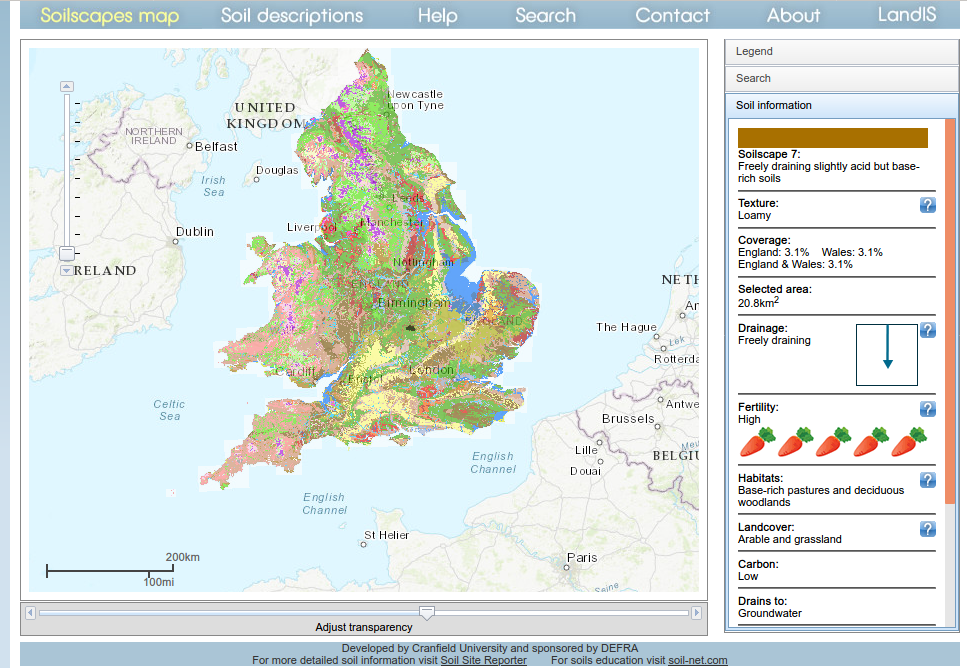
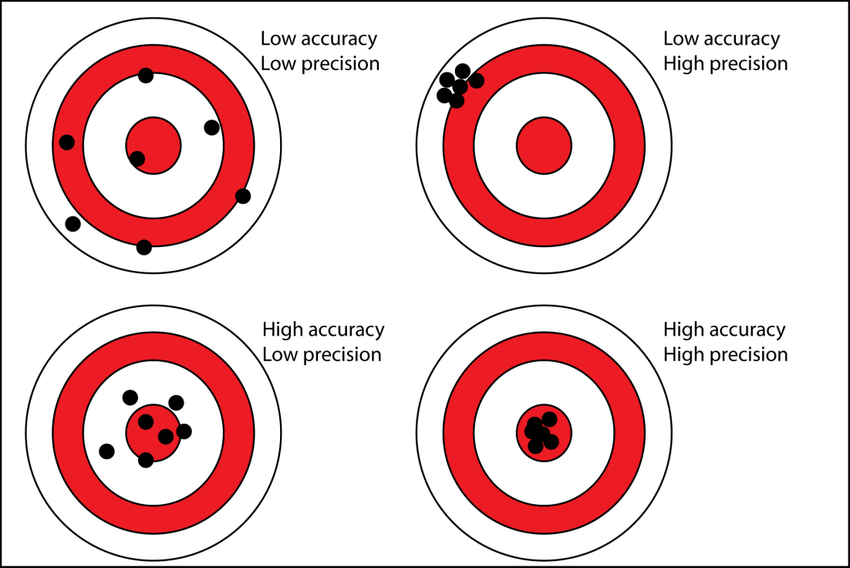
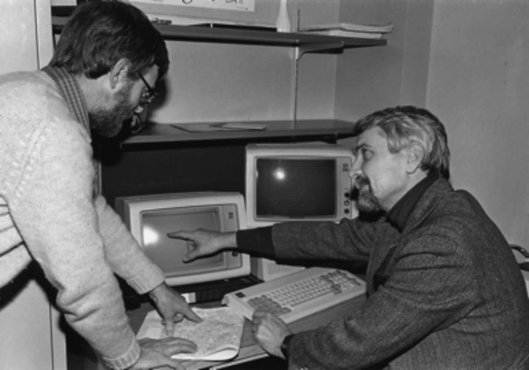
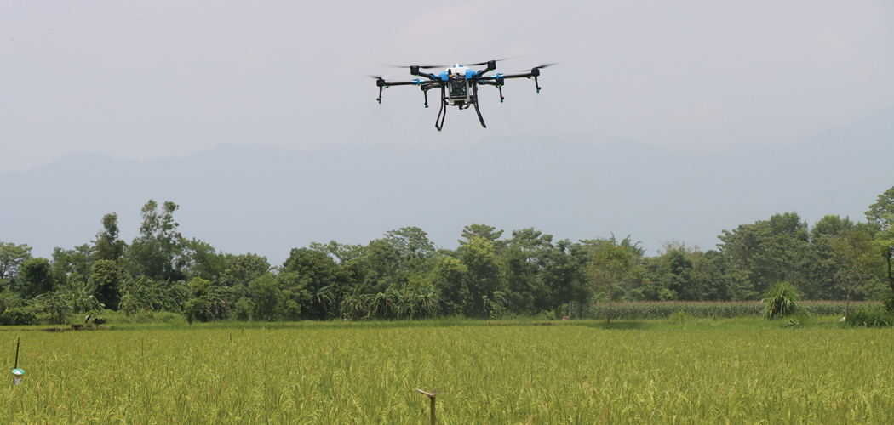
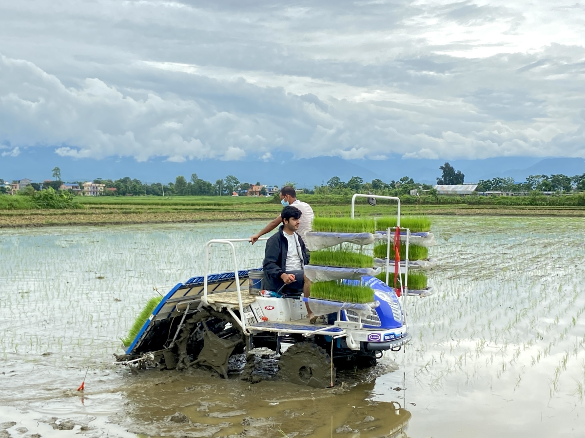
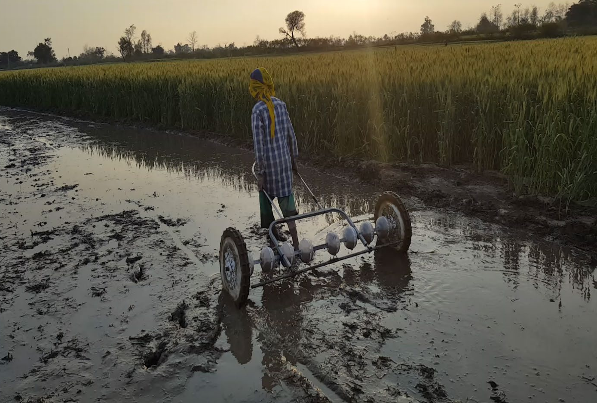
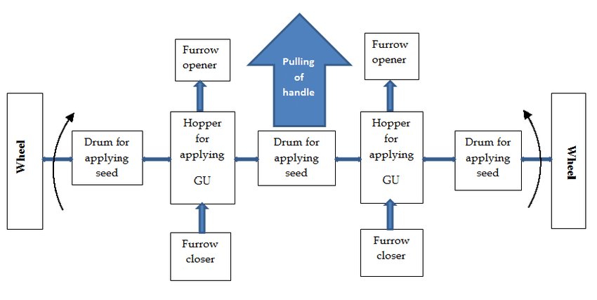
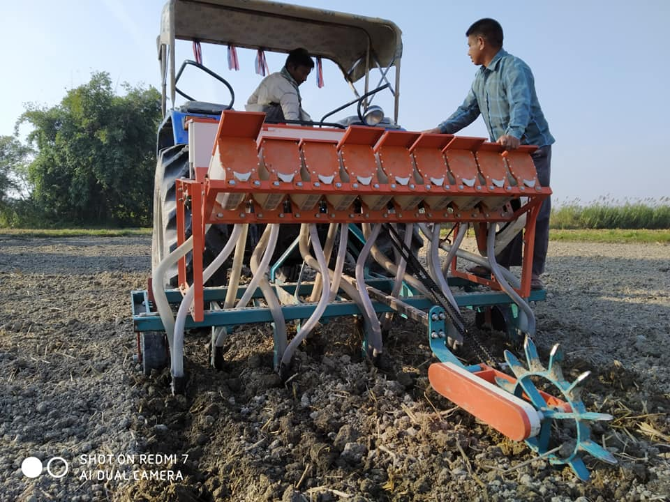
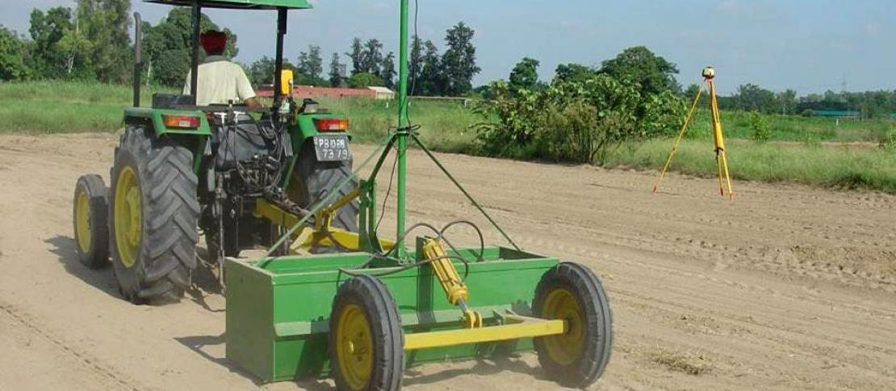
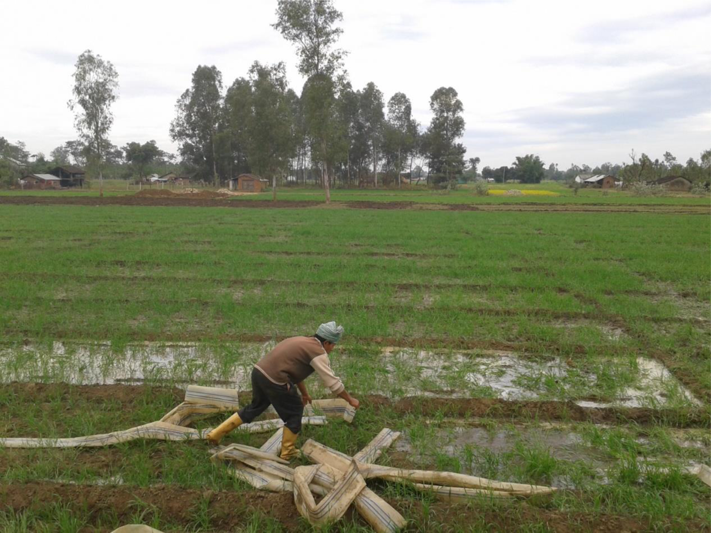

```{r setup, include=FALSE}
library(knitr)
require(tidyverse)
set.seed(453)
# invalidate cache when the package version changes
knitr::opts_chunk$set(tidy = FALSE, echo = FALSE, 
                  message = FALSE, warning = FALSE,
                  out.width = "45%", cache = TRUE, 
                  dev.args=list(bg=grey(0.9), pointsize=11))
options(knitr.table.format = "latex")
options(knitr.kable.NA = "", digits = 2)
options(kableExtra.latex.load_packages = FALSE)
theme_set(theme_bw())
```

# Concepts and techniques

##

\begin{alert}{Course objectives:}
The objective of this course is to provide theory as well as hands-on skill to students for various applications in Remote-sensing (RS), GIS and related technology for precision agriculture.
\end{alert}

\textit{"It would be a simple matter to describe the earth's surface if it were the same everywhere. The environment, however, is not like that: there is almost endless variety."}

\raggedleft --- Webster and Oliver (1990)

<!-- ## -->

<!-- \begin{flushright} -->
<!-- \rightskip=1.8cm\textit{``Motivation isn't enough. If you've an idiot and you motivate him, now you've a motivated idiot.''} \\ -->
<!-- \vspace{.2em} -->
<!-- \rightskip=.8cm---New world humour -->
<!-- \end{flushright} -->
<!-- \vspace{1em} -->

## Meaning and definition

- Management of \alert{variability} in the dimensions of both space and time!
- Any component of production agriculture -- plant genetic resource, production inputs, farm machinery, and farm operators -- are variable.
- All of these can be included in the realm of precision agriculture, not only the soil.
- Aspects include:
  - Variability of soil resource base
  - Weather
  - Plant genetics
  - Crop diversity
  - Machinery performance
  - Most physical, chemical and biological inputs used in the crop production (synthetic/natural)
- By necessity, all are framed within the context of the variable socio-economic aspects of production agriculture.
  - to be successful on the farm, precision agriculture must fit the needs and capabilities of the farmer and must be profitable.

##

\begin{columns}[T, onlytextwidth]
\column{0.6\textwidth}
\begin{itemize}
\small
\item Managing soil and crops in space and time is the sustainable management principle for the 21st century, exemplified by:
  \begin{itemize}
  \footnotesize
  \item Farming by soilscapes
  \item Managing zones within the field
  \item Managing the non-crop period
  \end{itemize}
\item Concerns of the technology:
  \begin{itemize}
  \footnotesize
  \item assistive technologies enabling the efficient use
  \item agronomic feasibility
  \item environmental efficacy
  \item performance with respect to economic and social impacts
  \end{itemize}
\end{itemize}

\column{0.4\textwidth}

```{r soilscape-uk, fig.cap="Georefrenced soilscapes map of UK. Source: \\url{http://www.landis.org.uk/soilscapes/}", out.width="98%", fig.align="center"}

```
\end{columns}

\begin{block}{Known names of Precision agriculture}
Farming by the foot, farming by soil, variable rate technology (VRT), spatially variable farming, prescription farming, site-specific crop production, site-specific management...
\end{block}

##

\begin{block}{Stafford (1996)}
"The targeting of inputs to arable crop production according to crop requirements on a localized basis"
\end{block}

- 4R principle:
  - Right thing
  - Right place
  - Right time
  - Right way

\begin{block}{NRC, Board on Agriculture Committee, US}
"A management strategy that uses information technologies to bring data from multiple sources to bear on decisions associated with crop production."
\end{block}

"Precision agriculture is the application of technologies and principles to manage spatial and temporal variability associated with all aspects of agricultural production for the purpose of improving crop performance and environmental quality."

## Precision versus Accuracy

```{r precision-vs-accuracy, out.width="36%", fig.cap="Precision verus accuracy. Something can be precise but not accurate."}

```

\footnotesize
- Nature of computers makes it easy to imply more *precision* than was possible in various aspects of data collection, analysis, computation in precision agriculture.
- Precision refers to the limits on the measurement scale between which the true measurement is believed to lie, implied by the number of digits reported for a measurement.
  - A pH of 5.4 or 5.44

## The idea

- Intuitively appealing
  - scientific principles of management of soils, crops, and pests
  - arguing against a management philosophy that aims at matching inputs to the exact needs everywhere is not easy.
- Successful implementation of precision agriculture depends on numerous factors, including:
  - the extent to which conditions within a field are known and manageable,
  - the adequacy of input recommendations,
  - the degree of application control,
  - the degree of support through private and public infrastructures,
  - the expectations of individual (how do you know maximum potential has been reached?)

## Basic components

- Measurement and understanding of variability
- Use information to manage this variability by matching inputs to conditions within fields using \alert{site-specific management recommendation}
- Mechanism to control the accuracy of site-specific inputs
- Provide for the measurement and recording of the efficiency and efficacy of these site-specific practices in order to assess value on and off the farm.

## Precision fertilizer management: An example use case

- In conventional farming system, blanket application of high amounts of nitrogen fertilizer has been in practice.
- Soil's nutrient mobility potential (due to soil physical and chemical properties), soil moisture, crop/variety specific demand and field micro-variations are unaccounted.
  - N losess are due to $NO^{-}_3$ leaching and $NH^{+}_4$ volatilization
  - Higer cost of production (added cost of input fertilizer purchase in order to compensate for loss)
- Collecting in-season biomass sample for analysis is cost prohibitive, labor intensive and destructive.

## Enabling technologies

1. Computers
2. Global positioning system (GPS)
3. Geographic information system (GIS)
4. Sensors
5. Application control

## Early history

\begin{columns}[T, onlytextwidth]

\column{0.7\textwidth}

\begin{itemize}
\small
\item Pierre Robert is often regarded as the father of precision farming
\item In 1982, Robert defended his PhD dissertation titled "Evaluation of some remote sensing techniques for soil and crop management"
  \begin{itemize}
  \footnotesize
  \item Showed that color infrared (CIR) aerial photography could be used to detect "Problems relating to drainage, erosion, germination, grass and weed control, crop stand damage and machinery malfunction."
  \item Suggested that CIR data could be used to build a "farm information and management system containing precisely located natural and cultural data to improve cost efficiency of future cultural practices. Such improvement could come, for example, from adjusting seed density, herbicide control or fertilization in response to detected field problems"
  \end{itemize}
\item Notes that anomalous reflectance patterns from row-cropped fields were associated with soil series boundaries
\end{itemize}

\column{0.3\textwidth}

```{r pierre-robers-computerized-farming, fig.cap="Pierre Robert explaining his computerized farming by soil map database (circa 1985) to Jim Anderson at the University of Minnesota.", out.width="98%"}

```

\end{columns}

# Tools of precision agriculture

##

- Soil sampling
- Geostatistics and GIS
- Farming by soil
- Variable rate fertilizer
- Site specific farming and management zones
- GPS
- Automated tractor navigation and robots
- Yield mapping
- Variable rate herbicide application
- Variable rate irrigation
- Remote sensing
- Proximal sensing of soil and crops

## Precision agriculture in Nepal

- Attempt to land categorization using digital soil map
- Micropropagation nurseries
- Drip irrigation system
- Use of cropping systems model of decision making
- Use of laser land leveler
- Rice planter
- Drone sprayer

##

\begin{columns}[T, onlytextwidth]
\column{0.5\textwidth}

```{r drone-spraying-pesticides-pmamp, out.width="98%", fig.cap="PMAMP, Chitwan using drones in the rice field for pesticide spray. The introduced drone of given design cost around NRS 1,500,000. It sprays the pesticide or liquid fertilizer 20 times as efficiently (requires lesser spray volume) as traditional hand held sprayer."}

```

\column{0.5\textwidth}

```{r mechanical-rice-planter, out.width="98%", fig.cap="An agriculture engineer operating rice transplanter. The PMAMP, Chitwan is trialing with mechanical aids to paddy plantation, management and harvest. The instruments are a four-wheel-drive riding-type rice planter, a combined harvester and plastic trays. A rice planter machine shown allows farmers to sow six saplings at a time instead of one and decreases the labour by 40-50 percent. The saplings are treated and kept in a tray that then efficiently places them into the soil. The machine can cover one bigha (around 72,900 square feet) of land per hour."}

```

\end{columns}

##

\begin{columns}[T,onlytextwidth]
\column{0.5\textwidth}

```{r drum-seeder, fig.cap="Use of drum seeder in rice seeding (useful for DST). It has three drums for applying seeds and two hoppers for applying Granulated Urea, which were placed over a shaft.", out.width="70%"}

```

```{r drum-seeder-mechanism, out.width="60%", fig.align='center'}

```

\column{0.5\textwidth}

```{r seed-cum-ferti-till-drill, fig.cap="Seed cum ferti till drill", out.width="90%"}

```

\end{columns}

##

```{r laser-land-leveler, fig.cap="Laser guided drag bucket for land levelling. This ensures a flat table-top like land surface which increases water use efficiency as irrigated water reaches every part of the field with minimal run-off or water-logging. It reduces irrigation times in rice by 47-69 hours/hectare per season and in wheat by 10-12 hours/hectare per season. Increases yield by about 8 percent."}

```

## Specific use cases in PA

- Soil water monitoring/ Inefficient or broken drainage
- Seed germination, plant density and crop growth rate,
- Viral, microbial, fungal diseases and insects' pests diagnostics,
- Weeds and other unwanted plant species monitoring,
- Plant nutrient deficiency diagnostics and management,
- Soil health and Soil-Microbes analysis,
- Food nutrients composition and Phyto-chemicals analysis,
- Weather forecast for cultivation
- Calendar for agricultural crop cultivation

## Limitations

- Land come with fixed size
- Despite all of these state of precision agriculture from a systems perspective is analogous to the early days of no-tillage crop production.
- No perfect form of precision agricultural systems exist as of yet!
- Only components of traditional crop management systems have been addressed separately regarding their potential for site-specific management, most notably soil fertility.
- Management parameters that vary spatially, those with high temporal correlations (e.g., liming) will be more easily managed with precision agriculture than those with large temporal variance (e.g., mobile insects).

# Common issues of precision agriculture for Nepal

##

\begin{columns}[T, onlytextwidth]
\column{0.5\textwidth}

\begin{itemize}
\item Farmers commonly split large, undulating crop fields, even those at similar elevation range or contour, into a
patchwork of small sub-plots in plane areas of Nepal.
\item Use of hotbeds, coldframes, shade house in horticulture.
\item Drone assisted diagnostics and prescription agriculture (DADAPA)
\item Cloud marketing system (CMS)
\end{itemize}

\column{0.5\textwidth}

```{r, out.width="90%"}

```

\end{columns}

## Issues with precision agriculture in Nepal

- Implementation of PA is fundamentally different for developed and developing country.
- Average land holding in Nepal is <0.6 ha per household.
- More than 80% of the farmers are smallholder and are practicing subsistence farming.
- Modern form of precision farming hinges on skilled human resources for its adoption 
  - knowledge about IoT and IT technologies
  - use of recent innovations and research
- Lays emphasis on extensive mechanization
- Adds to the cost of smallholder
- Financial support systems are underdeveloped
- Slower adoption rate (social structure); besides being technology averse, smallholders may often hinder the progress of expansion of technology
- Existing infrastructure bottleneck
  - irrigation
  - roadways

## Possible solutions

- professional human resource development;
- policy initiated and/or supported investments into infrastructure;
- affordable handsets and reduced device costs;
- available and affordable access to Internet for the farmers funded by different institutions (public or donor financed);
- solutions between low- and high-level services (e.g. between SMS and 4 or 5G networks).
- development and open publication of site specific soil maps, supported by public institution.

# Bibliography

## References

<!-- (Advances in agronomy, vol 67) -->
<!-- https://youtu.be/HYozoSHt4T0 -->
