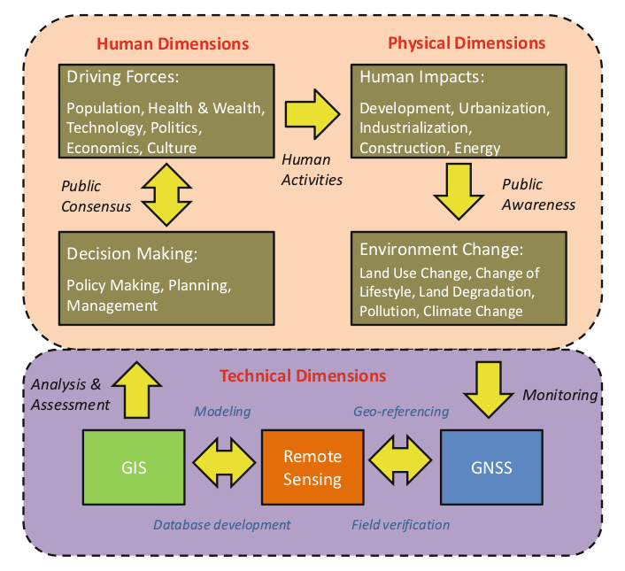
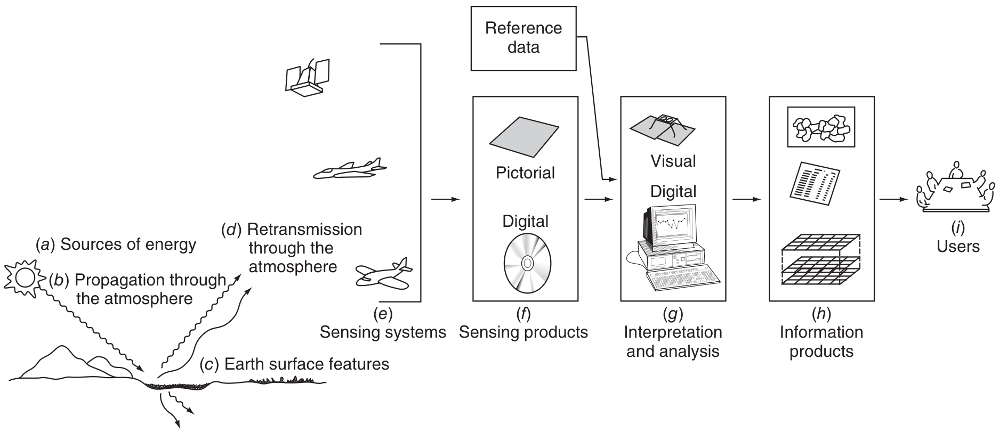
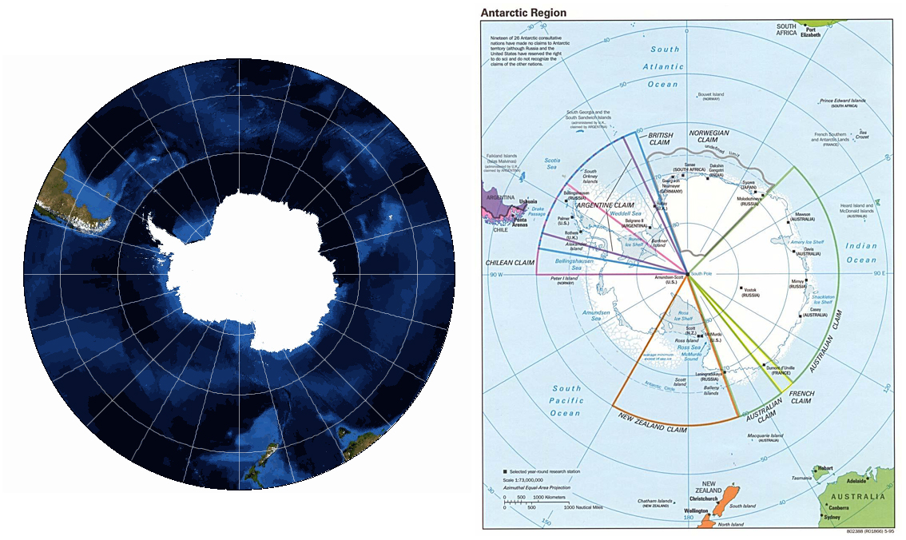
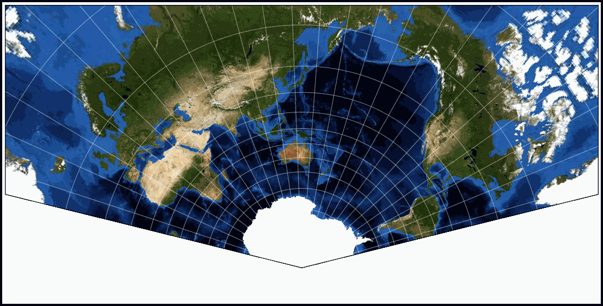
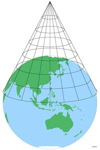
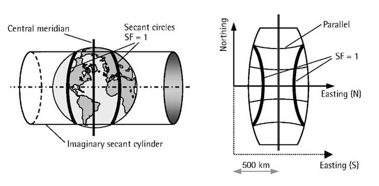

```{r setup, include=FALSE}
library(knitr)
require(tidyverse)
require(sf)
require(sp)
require(ggfortify)
require(ggpmisc)
library(ggspatial)
library(mapdata)
# library(maps)
# library(maptools) # features transported to sp

set.seed(453)
# invalidate cache when the package version changes
knitr::opts_chunk$set(tidy = FALSE, echo = FALSE, 
                  message = FALSE, warning = FALSE,
                  out.width = "45%", cache = TRUE, 
                  dev.args=list(bg=grey(0.9), pointsize=11))
options(knitr.table.format = "latex")
options(knitr.kable.NA = "", digits = 2)
options(kableExtra.latex.load_packages = FALSE)
theme_set(theme_bw())

def.chunk.hook  <- knitr::knit_hooks$get("chunk")
knitr::knit_hooks$set(chunk = function(x, options) {
  x <- def.chunk.hook(x, options)
  ifelse(options$size != "normalsize", paste0("\n \\", options$size,"\n\n", x, "\n\n \\normalsize"), x)
})

```

# Geoinformatics

## Meaning and definition

- Science and technology dealing with the structure and character of spatial information, its capture, its classification and quantification, its storage, processing, portrayal and dissemination, including the infrastructure necessary to secure optimal use of this information.
- Categorized under technical geography
- Relies upon the theory and practical implications of geodesy.
- Geography and earth science increasingly rely on digital spatial data acquired from remotely sensed images analyzed by geographical information systems (GIS),
photo interpretation of aerial photographs

##

- For analysis of geographic information:
  - geospatial analysis and modeling (geocomputation),
  - geovisualization
- Also deals with:
  - development of geospatial databases,
  - information systems design,
  - human-computer interaction and
  - wired and wireless networking technologies

## Areas of geoinformatics

- Cartography
- Geodesy
- Satellite navigation
- Photogrammetry
- Remote sensing
- Spatial analysis
- Web mapping
- Navigation

## Digital earth

\footnotesize
- Digital Earth is the name given to a concept coined by former US vice president Al Gore in 1998, that describes a virtual representation of the Earth that is spatially referenced and interconnected with the world's digital knowledge archives. Furthermore, the greater part of this knowledge store would be free to all via internet.
- The global dimension of the digital earth concept is perhaps best captured by two excerpts from Beijing declaration on digital Earth:
  \begin{itemize}
  \scriptsize
  \item Digital earth is an integral part of other advanced technologies including: Earth observation, geo-information system, global positioning systems, communication networks, sensor webs, electromagnetic identifiers, virtual reality, grid computation, etc. It is seen as a global strategic contributer to scientific and technological developments, and will be a catalyst in finding solutions to international scientific and societal issues;
  \item Digital earth should play a strategic and sustainable role in addressing such challenges to human society as natural resource depletion, food and water insecurity, energy shortages, environmental degradation, natural disaster response, population explosion, and, in particular, global climate change.
  \end{itemize}

##

```{r conceptual-framework-geoinformatics, fig.align="center", fig.cap="Conceptual framework for wide applications of geo-informatics", out.width="55%"}

```

## Remote sensing and GIS

```{r remote-sensing-gis, fig.cap="An integrated framework for remote sensing and GIS.", out.width="88%"}

```

## Applications

\begin{columns}[T, onlytextwidth]
\column{0.5\textwidth}
\begin{itemize}
\small
\item Urban planning and land use management,
\item in-car navigation systems,
\item virtual globes,
\item public health,
\item local and national territory management,
\item environmental modeling and analysis,
\item military,
\item transport network planning and management,
\item agriculture,
\end{itemize}
\column{0.5\textwidth}
\begin{itemize}
\small
\item meteorology and climate change,
\item oceanography and atmosphere modeling,
\item business location planning,
\item architecture and archaeological reconstruction,
\item telecommunications,
\item criminology and crime simulation,
\item aviation and maritime transport
\item biodiversity conservation
\end{itemize}
\end{columns}

##

- agro-ecological zonation;
- quantitative assessment of soil carbon dynamics and land productivity;
- soil erosion inventory;
- integrated agricultural drought assessment and management. 
- cropping system analysis
  - information on existing cropping systems in a region with respect to areal extent of crops,
  - crop vigors/ yield and yearly crop rotation / sequence practices is important for finding out agricultural areas with low to medium crop productivity where sustainable increase in crop production can be achieved by adoption of suitable agronomic management packages including introduction of new crops etc.

# Tools and techniques

## Cartography

\bcolumns
\column{0.7\textwidth}
\small
- Study and practice of making and using maps. Combining science and aesthetics and technique, cartography builds on the premise that reality can be modeled in ways that communicate spatial information effectively.
\footnote[frame]{\url{https://proj.org/usage/projections.html}}. 
- Objectives of traditional cartography:
  - Set the map agenda and select traits (roads, land masses, political boundaries) of the object to be mapped.
  - Represent the terrain of the mapped object on flat media (projection)
  - Reduce the complexity (generalization).
  - Organize the elements of the map to best convey its message (map design)

\column{0.3\textwidth}

**Design matters!**

```{r design-matters-cartography, out.width="98%"}

```

\ecolumns

##

- Coordinate reference system defines how the visual mapping of spatial data should be done
  - CRS has projection parameters, which is configurable giving a variation in mapping
- Modern cartography constitutes theoretical and practical foundations of GIS and Geographic information science\footnote[frame]{Overview of CRS (in R) is available at: \url{https://www.nceas.ucsb.edu/sites/default/files/2020-04/OverviewCoordinateReferenceSystems.pdf}}.
- EPSG Geodetic Parameter Dataset (also EPSG registry) is a public registry of geodetic datums, spatial reference systems, Earth ellipsoids, coordinate transformations and related units of measurement. Originally created by European Petroleum Survey Group (EPSG). Each entity is assigned an EPSG code between 1024-32767, along with a standard machine-readable well-known text (WKT) representation. 

## Map types

- General vs. thematic cartography
  - General:
    - Intended for general audience and containing a variety of features. Bear many reference and location systems.
  - Thematic: 
    - Specific geographic themes
    - Oriented toward specific audiences
    - Dot map showing corn production in different districts of Nepal divided into numerical choropleth classes.
    - With the increasing volume of geographic data, thematic cartography has become increasingly useful and necessary to interpret spatial, cultural and social data

## General cartography

\begin{columns}[T, onlytextwidth]
\column{0.6\textwidth}

```{r world-map-showing-nepal, out.width="95%", fig.width=4, fig.height=3}
# require(maps)
# require(ggspatial)

m_world <- maps::map("world", plot = FALSE, fill = TRUE)
m_nepal <- maps::map("world", "nepal", plot = FALSE, resolution = 0, fill = TRUE)
m_nepal_sp_df <- maptools::map2SpatialPolygons(m_nepal,
                                          IDs = sapply(strsplit(m_nepal$names, ":"), function(x) x[1]), 
                                          proj4string = raster::crs("+proj=longlat +datum=WGS84"))

labs <- data.frame(
  long = c(85.3240, 55.2708, -74.0060, 0),
  lat = c(27.7172, 25.2048, 40.7128, 0),
  names = c("Kathmandu", "Dubai", "New york city", "Universal traverse mercator coordinate"),
  stringsAsFactors = FALSE
  )

ggplot(data = tibble(long = m_world$x, lat = m_world$y),
       mapping = aes(x = long, y = lat)) +
  theme_minimal() + 
  geom_polygon(fill = "white", color = "black") +
  geom_polygon(data = tibble(long = m_nepal$x, lat = m_nepal$y), # nepal
               mapping = aes(x = long, y = lat),
               fill = "blue", color = "red", size = 2.5) +
  geom_point(data = labs, aes(x = long, y = lat), color = "black", size = 6) +
  geom_point(data = labs, aes(x = long, y = lat), color = "yellow", size = 4) +
  coord_sf(xlim = c(-180, 180), ylim = c(-90, 90), expand = FALSE,
           crs = "+proj=longlat +datum=WGS84") +
  xlab("Longitude") + ylab("Latitude") +
  ggtitle("World map showing Nepal \n(in Longlat projection, WGS84 datum)", subtitle = "Circles show landmarks. (from east to west) \nKathmandu, Dubai, UTM origin coordinate, New York City") +
  theme(panel.grid.major = element_line(color = gray(0.5), linetype = "dashed", size = 0.5),
        panel.background = element_rect(fill = "aliceblue"),
        title = element_text(size = 8)
       ) + 
  annotation_north_arrow(location = "tl", style = north_arrow_fancy_orienteering)+ 
  annotation_scale(location = "br", plot_unit = "km")
  # scalebar(location = "bottomright", dist = 4,
  # dist_unit = "km", transform = TRUE,  model = "WGS84")
```

\column{0.4\textwidth}

```{r nepal-sf-dataframe, out.width="98%", fig.width=4, fig.height=3}
np_dist <- sf::st_read("../data/npl_districts/NPL_districts_poly_sd_171123.shp", quiet = TRUE) %>%
  mutate(DISTRICT = fct_recode(DISTRICT, "CHITWAN" = "CHITAWAN"))

# np_dist %>% 
#   st_crs()

ggplot() +
  theme_minimal() + 
  geom_sf(data = st_geometry(np_dist), lwd = 0.3, color = "black") +
  xlab("Longitude") +
  ylab("Latitude") +
  ggtitle("Map of Nepal (in Modified UTM projection, \nWGS84 datum of everest 1830 ellipsoid)") +
  theme(panel.grid.major = element_line(color = gray(0.5), linetype = "dashed", size = 0.5),
        panel.background = element_rect(fill = "aliceblue"),
        title = element_text(size = 8)
       ) + 
  annotation_north_arrow(location = "tl", style = north_arrow_fancy_orienteering)+ 
  annotation_scale(location = "br", plot_unit = "m")
  # scalebar(location = "bottomright", dist = 4, 
  #          dist_unit = "km", transform = TRUE,  model = "WGS84")

```

\end{columns}

## Thematic cartography

```{r nepal-sf-dataframe-thematic, out.width="62%", fig.width=6.5, fig.height=5, fig.align='center'}
## Plotting districtwise rice production profile
dist_wise_maize <- readxl::read_xlsx("../data/npl_maize_districts_0506-1516.xlsx", sheet = "area", skip = 1)

dist_wise_maize <- dist_wise_maize %>% 
  mutate(District = str_to_upper(District)) %>% 
  mutate(District = str_replace_all(District,
                                    pattern = c("KAVREPALANCHOK" = "KABHREPALANCHOK", 
                                                "MAKWANPUR" = "MAKAWANPUR", 
                                                "KAPILVASTU" = "KAPILBASTU"))) %>% 
  rename(DISTRICT = District)

np_dist <- left_join(np_dist, dist_wise_maize, by = "DISTRICT") %>% 
  rename(Year201516 = `2015/16`)

maize_area_1516 <- ggplot() +
  geom_sf(data = st_geometry(np_dist), aes(fill = np_dist$Year201516), lwd = 0.3, color = "black") + 
  ggrepel::geom_label_repel(data = (np_dist %>% top_n(10, wt = Year201516) %>% arrange(desc(Year201516))) %>% 
                              mutate(lon=map_dbl(.$geometry, ~st_centroid(.x)[[1]]), # add centroid values for labels
                                     lat=map_dbl(.$geometry, ~st_centroid(.x)[[2]])), 
                            aes(x=lon, y=lat, label=DISTRICT), size = 2) +
  # best way to determine the position is through st_bbox() to get the bounding box
  annotate(geom = "table", x = 690000, y = 3380000, label = list(np_dist %>%
                                                            st_set_geometry(NULL) %>%
                                                            top_n(10, wt = Year201516) %>%
                                                            arrange(desc(Year201516)) %>%
                                                            dplyr::select(DISTRICT, "Area (ha)"= Year201516)),
           vjust = 1, hjust = 0, size = 1.4) +
  scale_y_continuous() +
  scale_fill_gradient(name = "Area in hectares", guide = "colourbar", low = "#132BCC", high = "#CC2B20") +
  # guides(fill=FALSE) + # remove legend
  xlab(NULL) + ylab(NULL) +
  theme_minimal() + 
  ggtitle("Estimated districtwise area of production of Maize grain in Nepal, \nfeaturing top 10 districts during\nYear: 2015/16\n(Source: Statistical Year Book, 2017)") +
  theme(panel.grid.major = element_line(colour = "turquoise"), 
        legend.position = "bottom", 
        text = element_text(size = 8),
        legend.text = element_text(angle = 45), legend.text.align = +1) # change the grid (graticule) color

maize_area_1516
```

## Projections

- Projections map the spherical 3D space to a flat 2D space \footnote[frame]{https://proj.org/usage/projections.html}.
- Projections are coordinate operations that are technically conversions but since projections are so fundamental to PROJ we differentiate them from conversions.

```{r projection-types1, results='asis'}
bind_cols_fill <- function(df_list) {
  max_rows <- purrr::map_int(df_list, nrow) %>% max()

  purrr::map(df_list, function(df) {
    if(nrow(df) == max_rows) return(df)
    first <- names(df)[1] %>% sym()
    df %>% add_row(!!first := rep(NA, max_rows - nrow(df)))
  }) %>% bind_cols()
}

cat("\\setlength{\\tabcolsep}{2pt}")
read_csv("../data/projections_proj.csv", col_names = FALSE, skip = 2, show_col_types = FALSE) %>%
  dplyr::select(projections = X1) %>%
  mutate(row_id = as.numeric(cut(row_number(), breaks = 10))) %>%
  group_split(row_id) %>%
  purrr::map(~dplyr::select(.x, -row_id)) %>%
  bind_cols_fill() %>%
  .[1:6, ] %>% 
  knitr::kable(booktabs = TRUE, col.names = rep("Projection", times = 10), format = "latex") %>%
  kableExtra::kable_styling(font_size = 4, position = "center") %>%
  kableExtra::column_spec(column = 1:10, width = rep("8em", 10))

```

##

```{r projection-types2, results='asis'}
cat("\\setlength{\\tabcolsep}{2pt}")
read_csv("../data/projections_proj.csv", col_names = FALSE, skip = 2, show_col_types = FALSE) %>%
  dplyr::select(projections = X1) %>%
  mutate(row_id = as.numeric(cut(row_number(), breaks = 10))) %>%
  group_split(row_id) %>%
  purrr::map(~dplyr::select(.x, -row_id)) %>%
  bind_cols_fill() %>%
  .[7:16, ] %>% 
  knitr::kable(booktabs = TRUE, col.names = rep("Projection", times = 10), format = "latex") %>%
  kableExtra::kable_styling(font_size = 4, position = "center") %>%
  kableExtra::column_spec(column = 1:10, width = rep("9em", 10))
```

##

\footnotesize
- Projections are generally given a name so that they can be easily identified and referenced on a map.
  \begin{itemize}
  \footnotesize
  \item named after the person(s) who invented them (eg Mercator); or aspects of the projection (eg Equidistant Conic); or a combination of the two (eg Lambert Conformal Conic).
  \end{itemize}
- All projections result in some distortion of the relationships between features on the sphere when they are projected onto a flat surface. These distortions include:
  \begin{itemize}
  \footnotesize
  \item direction between a feature and surrounding features
  \item distance between a feature and surrounding features
  \item shape of any feature
  \item size of any feature
  \end{itemize}
- Only 'projection' which has all the features without distortion in a globe.
- This problem is in part due to the changing relationship between latitude and longitude.
  \begin{itemize}
  \footnotesize
  \item Near the Equator a 'block' of $1^\circ \times 1^\circ$ latitude and longitude is almost a square, while the same 'block' near the poles is almost a triangle.
  \end{itemize}
- Technical terms used to describe the line of latitude or longitude where this imaginary 'piece of paper' touches the Earth are:
  \begin{itemize}
  \footnotesize
  \item latitude – standard parallel
  \item longitude – central meridian
  \end{itemize}

## Basic Projection Types

<!-- https://www.icsm.gov.au/education/fundamentals-mapping/projections/commonly-used-map-projections -->

- This describes how a map shows the positional relationship between two features, and their size and shape.
- Depending on their intended use, projections are chosen to preserve a particular relationship or characteristic. These include:
  - Equal-Area: correctly shows the size of a feature
  - Conformal: correctly shows the shape of features (A map can not be both equal-area or conformal -- it can only be one; or the other; or neither.)
  - Equidistant: correctly shows the distance between two features
  - True Direction: correctly shows the direction between two features

## Basic Projection Techniques

\bcolumns
\small
\column{0.55\textwidth}
- For an imaginary 'piece of paper' touching the Earth, there are 3 basic techniques used to create a projection and therefore a map. These are:
  \begin{itemize}
  \footnotesize
  \item azimuthal: the imaginary 'piece of paper' is flat, this is usually used over Polar areas
  \item conical: the imaginary 'piece of paper' is rolled into a cone, this is usually used in mid-latitude areas (approximately $20^\circ - 60^\circ$ North and South)
  \item cylindrical: the imaginary 'piece of paper' is rolled into a cylinder, this is usually used over Equatorial areas or for World Maps
  \end{itemize}
- Each of the basic techniques have different distortions and therefore limitations to their use.

\column{0.45\textwidth}

```{r azimuthal-projection, fig.cap="Azimuth is a mathematical concept with relates to the relationship between a point and the 'flat piece of paper' that 'touches' the Earth. Maps produced using Azimuthal Projections (often called polar projections) techniques have lines of longitude fanning out from the centre and lines of latitude as concentric circles. It is usually measured as an angle. The projection have distortions increasing away from the central point.", out.width="98%"}

```

\ecolumns

##

\bcolumns
\column{0.5\textwidth}

```{r conic-projection, fig.cap="This map is centred on central Australia and the Standard Parallel is $25^\\circ$ South. Note how the shapes of land masses near the Standard Parallel are fairly close to the true shape when viewed from space. This includes Australia, South America and the 'tip' of Africa. Also note how land masses furthest away from the Standard Parallel are very distorted when compared to the views from space. Particularly note how massively large northern Canada and the Arctic icecaps look.", out.width="55%"}

```

```{r, out.width="28%", fig.align='center'}

```

\column{0.5\textwidth}

\begin{figure}
  \begin{center}
  \includegraphics[width=0.7\linewidth]{../images/cylindrical_projection.png}
  \end{center}
  \begin{columns}[T,onlytextwidth]
  \column{.45\linewidth}
  \begin{center}
  \includegraphics[width=0.65\linewidth]{../images/cylindrical_projection_cap.jpg}
  \end{center}
  \column{.55\linewidth}
  \caption{\newline\tiny This follows the concept of a 'piece of paper' being rolled into a cylinder and touching the Earth on a circular line. Notice the huge distortions in the Arctic and Antarctic regions, but the reasonable representation of landmasses out to about 50° north and south. Projection information: Mercator; centred on 140° East and the Standard Parallel is the Equator}
  \label{fig:cylinder-project}
  
  \end{columns}
\end{figure}

\ecolumns

## Mercator projection

\small
- Standard map projection for nautical purposes because of its ability to represent lines of constant true direction.
- The cylinder is usually positioned over the Equator, but this is not essential (but always has the Equator as its Standard Parallel).
- Its construction is such that the lines of longitude and latitude are at right angles to each other - this means that a world map is always a rectangle.
- The lines of longitude are evenly spaced apart. But the distance between the lines of latitude increase away from the Equator. 
<!-- - This relationship is what allows the direction between any two points on the map to be constant true direction. -->
<!-- - While this relationship between lines of lines of latitude and longitude correctly maintains direction, it allows for distortion to occur to areas, shapes and distances. Nearest the Equator there is little distortion. Distances along the Equator are always correct, but nowhere else on the map. Between about $15^\circ$ north and south the areas and shapes are well preserved. Further out (to about $50^\circ$ north and south) the areas and shapes are reasonably well preserved. This is why, for uses other than marine navigation, the Mercator projection is recommended for use in the Equatorial region only. -->
- Despite some distortions the Mercator projection is generally regarded as being a conformal projection. This is because within small areas shapes are essentially true.
- Tiles from Google Maps, Open Street Maps, Stamen map are projected in Mercator (assigned EPSG code: 3857)

## Universal Traverse Mercator (UTM) projection

\footnotesize

- UTM coordinate comprises a zone number, a hemisphere (N/S), an easting and a northing. Eastings are referenced from the central meridian of each zone, & northings from the equator, both in metres. To avoid negative numbers, 'false eastings' and 'false northings' are used:
- Eastings are measured from 500,000 metres west of the central meridian. Eastings (at the equator) range from 166,021m to 833,978m (the range decreases moving away from the equator); a point on the the central meridian has the value 500,000m.
- In the northern hemisphere, northings are measured from the equator - ranging from 0 at the equator to 9,329,005m at 84 degree N). In the southern hemisphere they are measured from 10,000,000 metres south of the equator (close to the pole) - ranging from 1,116,915m at 80 degree S to 10,000,000m at the equator.
- Nepal lies in the UTM zone of 440N and 450N. The scale factor is 0.9996 for the central meridian. 10 49’ east or west of central meridian has the scale factor of 1.

\scriptsize
- Norway/Svalbard: the designers of UTM made two exceptions to the rule. The part of zone 31 covering western Norway is transferred to zone 32, and the zones covering Svalbard are tweaked to keep Svalbard in two zones (it's easier to understand looking at a map). These widened zones are viable partly because zones are much narrower so far north, so little precision is lost in merging them.

<!-- ## -->

<!-- \begin{columns}[T, onlytextwidth] -->
<!-- \column{0.3\textwidth} -->

<!-- ```{r utm-projection-geometry, out.width="99%"} -->
<!--  -->
<!-- ``` -->

<!-- \column{0.7\textwidth} -->

<!-- \begin{itemize} -->
<!-- \scriptsize -->
<!-- \item Traditionally Universal Transverse Mercator (UTM) Projection system has been in use in Nepal; Mercator projection is Conformal Cylindrical Projection. -->
<!-- \item In Transverse projection, Earth is wrapped around a cylinder in such a manner that point of tangency between Globe and Cylinder is a meridian, or line of longitude, called Central Meridian. In Conformal or Orthomorphic Projection, the shape/angle is preserved even though the length and breadth may distort. -->
<!-- \item UTM consists total of 60 zones of longitude each of 60 extending from 180 W to 180 E. 180 W to 174 W is designated as zone 1 with the central meridian of 177 W and other zone goes as so on and so further manner. Further zone are divided in rows with a difference of 8. These zone extend from 80 S Latitude to 84 N latitude. The first Latitude zone is designated with letter C for 80 S to 72 S latitude. -->
<!-- \item In recent years with cadastral survey and various accuracy techniques, Nepal has default projection set to MUTM (Modified UTM) -- a Gauss-Krueger projection-based coordinate system. In this system, earth is divided in 120 zones each of 3 degree. -->
<!-- \item Nepal has central meridian of 81 degree, 84 degree and 87 degree. -->
<!-- \item Scale factor of 0.9999 is used for central meridian normally for 84 degree and 0 degree 55 minutes east or west of central meridian has the scale factor of 1 (meaning no distortion). -->
<!-- \item False Easting at central meridian is 500,000 m in order to keep all the coordinates within the country positive, and False Northing at the Equator is 0 m. -->
<!-- \end{itemize} -->
<!-- \end{columns} -->

## Coordinate reference system (CRS)

\bcolumns
\column{0.5\textwidth}
\footnotesize
- Latitude/Longitude
  \begin{itemize}
  \scriptsize
  \item WGS84 (EPSG: 4326)
  \item Commonly used by organizations that provide GIS data for the entire globe or many countries. CRS used by Google Earth
  \end{itemize}
- NAD83 (EPSG:4269)
  \begin{itemize}
  \scriptsize
  \item Most commonly used by U.S. federal agencies.
  \end{itemize}
- NAD27 (EPSG: 4267)
  \begin{itemize}
  \scriptsize
  \item Old version of NAD83
  \end{itemize}
- Projected (Easting/Northing)
  \begin{itemize}
  \scriptsize
  \item UTM, Zone 10 (EPSG: 32610)
  \item Zone 10 is used in the Pacific Northwest
  \end{itemize}

\column{0.5\textwidth}

```{r raster-vector-crs-verbatim1, warning=FALSE, message=FALSE, size = "tiny"}
# Coordinate systems in R (https://mgimond.github.io/Spatial/coordinate-systems-in-r.html)

# the website loads from github repo
# we have the data saved as image in data directory so load from that instead.
# load(url("https://github.com/mgimond/Spatial/raw/main/Data/Sample1.RData"))
load("../data/Sample1.RData")
# Only two data layers will be used in this exercise: a Maine counties polygon layer (s.sf) and an elevation raster layer (elev.r). The former is in an sf format and the latter is in a raster format.
# other objects are removed
rm(list=c("inter.sf", "p.sf", "rail.sf"))
require(sf)

# # Note the versions of GEOS, GDAL and PROJ the package sf is linked to.
# sf_extSoftVersion()[1:3]

# To extract coordinate system (CS) information from an sf object use the st_crs function.
# cat("\\scriptsize", "\n")
stdout_crs <- st_crs(s.sf)$wkt %>% str_split("\n") %>% unlist()

st_crs(s.sf)

# cat("\\begin{verbatim}")
# cat(stdout_crs[1:20], "...", sep = "\\\\\n")
# cat("\\end{verbatim}")

# The CRS output will also consist of a user defined CS definition which can be an EPSG code (as is the case in this example), or a string defining the datum and projection type.

# To extract CS information from a raster object use the crs function from the raster package.

library(raster)
crs(elev.r)

# Up until recently, there has been two ways of defining a coordinate system: via the EPSG numeric code or via the PROJ4 formatted string. Both can be used with the sf and raster objects

# The PROJ4 syntax consists of a list of parameters, each prefixed with the + character. For example, elev.r's CS is in a UTM projection (+proj=utm) for zone 19 (+zone=19) and in an NAD 1983 datum (+datum=NAD83).
```

\ecolumns

<!-- ## -->

<!-- ```{r map-projection-mercator, out.width="95%", fig.width=4, fig.height=3} -->
<!-- # require(ggfortify) -->
<!-- # require(ggpmisc) -->
<!-- # simple_features_object %>% -->
<!-- #   st_set_crs("+proj=utm +zone=19 +ellps=GRS80 +datum=NAD83") -->

<!-- # # plot map of nepal in mercator -->
<!-- # ggplot() + -->
<!-- #   geom_sf(data = st_geometry(np_dist), lwd = 0.3, color = "black") + -->
<!-- #   labs(title = "Mercator projection") + -->
<!-- #   theme_minimal() -->

<!-- # np_dist_utm_proj <- st_set_crs(np_dist, 26919) # UTM NAD83 Zone 19N EPSG code equivalent is 26919. -->

<!-- # # Azimuthal equidistant projection centered on Maine, USA (69.8degree West, 44.5degree North) -->
<!-- # st_transform(np_dist, "+proj=aeqd +lat_0=44.5 +lon_0=-69.8 +x_0=0 +y_0=0 +ellps=WGS84 +datum=WGS84 +units=m +no_defs") -->

<!-- # # World Robinson projection -->
<!-- # st_transform(np_dist,"+proj=robin +lon_0=0 +x_0=0 +y_0=0 +ellps=WGS84 +datum=WGS84 +units=m +no_defs") -->

<!-- # # World sinusoidal projection -->
<!-- # st_transform(np_dist,"+proj=sinu +lon_0=0 +x_0=0 +y_0=0 +ellps=WGS84 +datum=WGS84 +units=m +no_defs") -->

<!-- ``` -->


## Use in precision agriculture

1. Agricultural mapping
  - Current and future variations in the rainfall
  - Crop output and temperature of the soil
  - Farm resource and structure mapping
2. Soil analysis
  - Mapping of soil type and crop suitability
  - Nutrient and fertilizer status mapping
3. Data combination
  - Realistic appraisal of farm production to assist insurance
  - Farmers could access data of their crops across the seasons to compare and contrast

##

4. Increased interaction
  - Humans have better sense of space and time than any other variables
  - Using machinery and GIS (including on-ground data), interventions could be more efficiently and effectively applied.
5. Assembly of information to develop systems based models
  - Various layers of information such as soil moisture, nutrients, elevation, topography, irradiance, cloud cover, etc. could aid in feeding into growth models
  - These could be translated into recommendation systems for precise implementation.

##

6. Real-time mapping
7. Raising alert and disaster mapping
8. Historical data comparison
9. Boosting production

# Common issues and concerns of geoinformatics in Nepalese agriculture

## Current state

- GIS based technology has already permeated through engineering discipline and seen its applications.
- Recently, natural resource management (forest, watershed) operations also have begun making use of geo-spatial data.
  - tracking of forest and shrubland coverage using geo-spatial data
  - monitoring of wildlife species using GPS tracker
- Agriculture have a long experience of poor information management system, which is in-part responsible for its dwindling state

## Issues and concerns

- Although input availability and use are major factors affecting production, decision making on farmer level regarding these issues are still not informed by data
- Most farmers are resource poor and non-commercial cultivators
  - only heavily mechanized farmholds can exploit technology at fullest.
  - geoinformatic technologies only provides benefit at scales
- Data management and computational environments are not tailored for use among farmers in Nepal
- Only limited open database provide contextual data relevant for Nepal
- Data publications by government institution are very unorganized and contingent.
- Data privacy issues

##

- Most farmers are reluctant to trust computer or digital systems for decision making, due to
  - farmers do not have knowledge of how information systems work
  - systems being still immature have sometimes produced unreliable outcomes
- Government is still ignorant of the possibilities geo-informatics has for agriculture system

# Bibliography

## References
