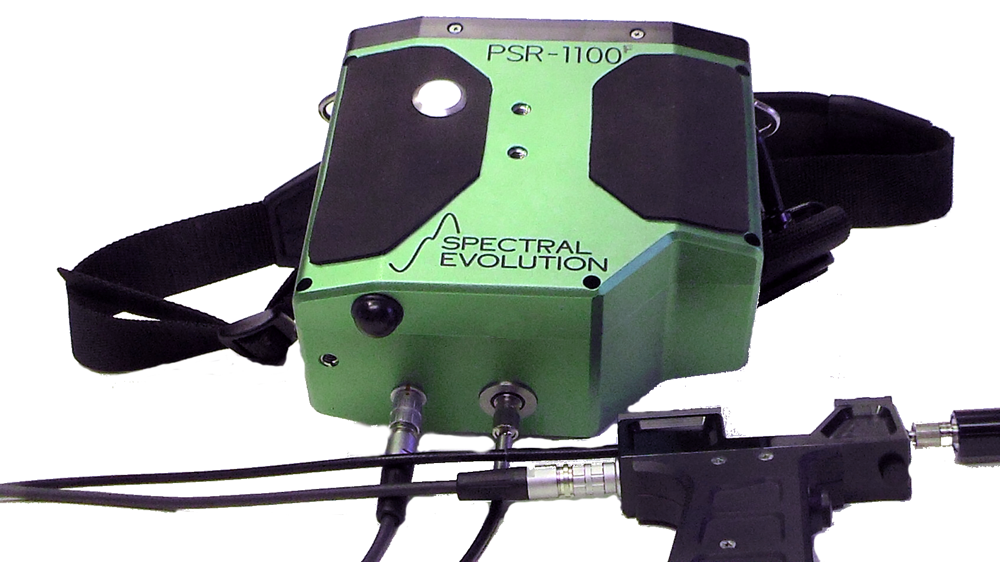
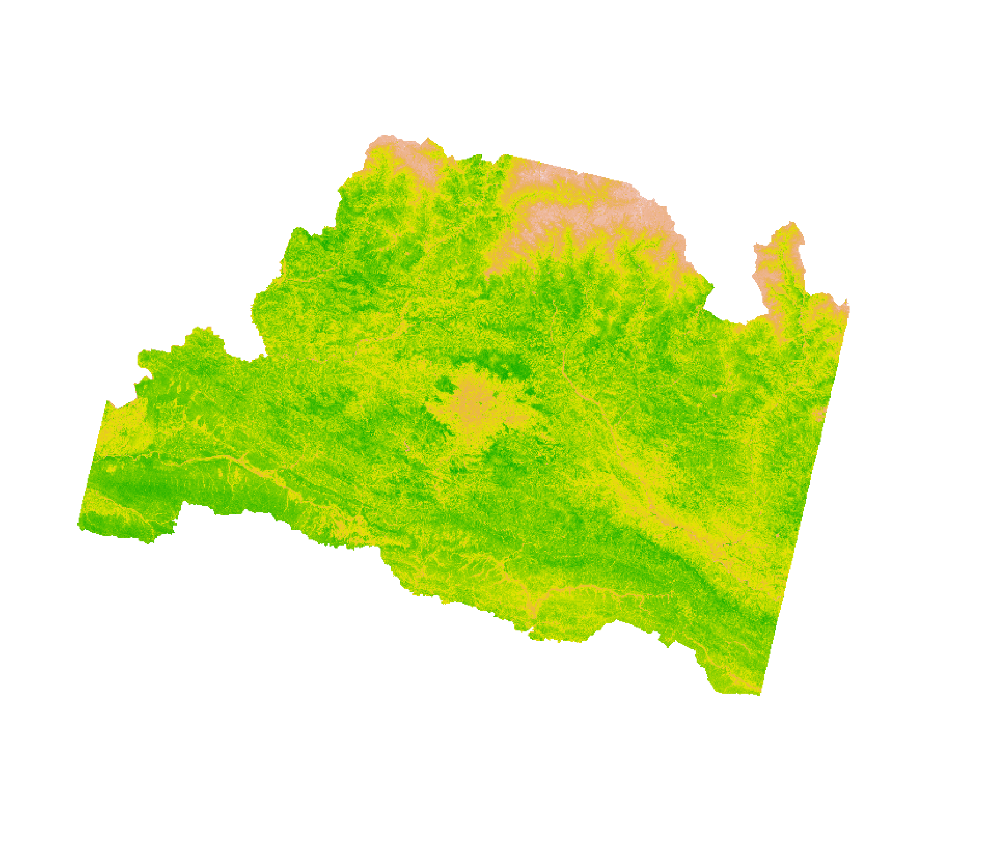

```{r setup, include=FALSE}
library(knitr)
require(tidyverse)
set.seed(453)
# invalidate cache when the package version changes
knitr::opts_chunk$set(tidy = FALSE, echo = FALSE, 
                  message = FALSE, warning = FALSE,
                  out.width = "45%", cache = TRUE, 
                  dev.args=list(bg=grey(0.9), pointsize=11))
options(knitr.table.format = "latex")
options(knitr.kable.NA = "", digits = 2)
options(kableExtra.latex.load_packages = FALSE)
theme_set(theme_bw())
```

# Crop cutting

## Crop area and crop production assessment

- Information about crop area and production is crucial for planning of economic development initiatives, allocation of resources and monitoring the achievements
- Area and production statistics has great importance for planners
  - preparation of national accounts of food crops
  - decision making on export/import and price
  - day to day management of the crop sector
- Statistical Information on Nepalese Agriculture (the annual agri-statistics publication) hosts acerage, crop production and basic farming household statistics.
- The data collection is entrusted to extension staff, who carry out crop cut \alert{surveys} to assess crop yield.

##

- Crop cutting surveys are field surveys in which production data are collected through direct measurement for estimating yield of major field crops, paddy and wheat.
- The technique was developed during 1940s and 1950s.
- A \alert{plot} is \alert{randomly} selected of a given size in the field of a specific crop and its produce is harvested following specified methodology.
- The harvested yield rate is calculated as the weight of the harvested crop divided by the area of the plot.

$$
\text{Estimated crop yield} = \frac{\text{Weight of harvest crop}}{\text{Area of the selected plot}}
$$

## Steps in Crop-cutting

- Selecting a field of mature crop ready for harvest
- Identifying the south-west corner of field from where crop cut has to be done
- Randomly demarcating the crop-cutting plot of a specified size (generally 10 or 20 msq)
- Meticulously determining the plants to be included in the crop-cut plot
- Harvesting of crop cut plot
- Threshing and winnowing to get cleaned harvest
- Weighing and adjusting the harvet to a specified level of moisture content
- Converting the harvest to a standard unit, for example tons per hectare.

## Crop cutting survey design and selection

- The design adopted in the survey is stratified multi-stage random sampling
  - Districts are taken as strata
  - Specific local units (municipalities) are the first stage units
  - Fields growing the crop under crop cutting experiments are the second stage units
  - Experimental plots of specified size are the ultimate stage units
- In the strata, list of all villages with area growing the experimental crop is obtained
- Generally in a district with 30 local units, 8-10 municipals are selected by SRS.
- In field selection, agriculture technician proceeds to the selected village.
  - Cultivators are listed and serial number assigned to their fields
  - Fields are selected by SRS

## General considerations

- Area of selected field should be more than the total area of CCE plot.
- The experimental crop in the field is not meant for seed production or demonstration.
- If experimental crop is not germinated or has failed (cattle or pest damaged, affected by disease or heavy rainfall, inadequate rainfall), field is still considered for selection.
- The crop cutting experiment should not be conducted in the selected field if a part or whole of the selected field has already been harvested.

## Locating of experimental plot

- Identification of south-west corner of the field (for consistency purpose in all surveys)
- Start from SW corner of the field and measure in steps the length and breadth of the field
- From the total number of steps of both length and breadth, deduct seven steps from each
- Select experimental plot randomly (using a pair of random numbers to locate row-column combination)
  - for example, if the length is 86 steps, the remainder is 86-7 = 79 and the breadth is 45 steps the remainder is 45-7 = 38
  - select two random numbers one for length (<79) and other for breadth (<38)
  - locate the plot based on selected pair of numbers, and fix a peg at that point.

## Harvesting and yield estimation

- Harvested when crop is fully mature
- Date is fixed by the field assistant in consultation with the cultivators concerned
- Produce from the plot is harvested before the harvest of the entire field
- Threshing, winnowing, weighing of the harvested produce and recording of green/fresh produce
- Driage experiments are performed to get marketable form of produce from cultivating fields.
  - dry a fixed quantity of harvested produce (generally 1 kg) in the experimental plot by keeping the produce for a few days for drying and weighing the produce everyday till the weighings on two successive days reveal "negligible"  reduction in weight

##

- Weight of marketable produce of crop may be obtained by applying the moisture level recorded with the moisture meter to the normal level of moisture of the produce as per:

$$
\begin{aligned}
WG_{14\%} = FW \times \frac{100-MCG}{100-14} = FW \times \frac{100-20}{100-14}
\end{aligned}
$$
where: 

\footnotesize

- $FW$ = Fresh weight,
- $MCG$ (in %) = Moisture content of grain when fresh (say 20%),
- $WG_{14}$ (in %) = Weight of grain adjusted to 14% moisture content.

## Requirements for crop cutting experiment

- Measuring tape (~30m and above)
- Weighing balance
- Small gunny bags for driage experiment
- Hessian cloth
- Four straight, long bamboo pegs each of 1m length with spikes at one end and irron collars at the other end.
- Record book

## Estimation

- In countries with regular agricultural reporting system, crop area ($A$) is obtained from records on complete enumeration basis.
- Average crop yield ($Y$) is estimated by CCE on a sample basis.

$$
\text{Crop production} (P) = A \times Y
$$

- In countries where cadastral maps are available not no regular reporting system, both A and Y are estimated on the basis of sample surveys.
- Usually large sample of villages (primary units) is selected for crop area estimation. This provides estimate of A
- CCE are carried out in a sub-sample of the primary units selected for area enumeration. This provides estimate of $Y$.

## Estimation

- Estimating yield from a district survey:

```{r estimation-yield}
tribble(~"a", ~"b",
        "Number of stratum", "$S$",
        "Area under the crop in the $s^{th}$ stratum", "$a_s$",
        "Number of villages (i)", "$n_s$",
        "Number of field (j) in the $i^{th}$ village", "$n_si$",
        "Experimental plot selected", ""
        ) %>% 
  knitr::kable(format = "latex", booktabs = TRUE, col.names = c("", ""), escape = FALSE) %>% 
  kableExtra::kable_styling(font_size = 8)
```

##

If $y_{sij}$ be the observed yield from the selected plot of the $j^{th}$ field of the $i^{th}$ village of the $s^{th}$ stratum, then

Estimated average of green yield for the $s^{th}$ stratum is:

$$
\hat{\bar{Y}}_s^g = \frac{1}{n_s} \sum^{n_{s}}_{i = 1} \frac{1}{n_{si}} \sum^{n_{si}}_{j = 1} y_{sij}
$$

Estimate of the district level average yield of the dry marketable produce per hectare is given by:

$$
\hat{\bar{Y}}^m = d \times f \frac{\sum^S_{s = 1} a_s \hat{\bar{Y}}_s^g}{\sum^S_{s = 1}a_s}
$$

Where:

- d: driage ratio, 
- f: conversion factor for green yield to dry marketable produce per hectare i.e. rice = 2/3 of paddy.

## Remote sensing for crop cut surveys

https://www.icrisat.org/icrisat-uses-satellite-data-to-assess-crop-cutting-experiments-for-crop-yield-estimations/


# Crop/vegetation discrimination

##

- Cells in plant leaves effectively scatter light because of the high contrast in the index of refraction between water-rich cell contents and inter-cellular air spaces.
- Plants that are engaged in photosynthesis use blue and red light as energy sources. They reflect little light back from these wavelengths.
- The underlying principle for using NIR is that plants with different nutrient levels reflect light differently in specific wavelengths.

## Direct advantages

- Fast and non-destructive,
- Once calibrated correctly, reliably measures biophysical and biochemical vegetation variables
- Covers a large spatial area at once
- Temporal imaging helps analyze crop growth processes 

##

- Researchers use portable spectroradiometer such as the PSR+ to study vegetation in-situ and confirm, modify, and better understand hyperspectral remote sensing data from satellites such as Sentinel, or plane flyovers.
- By capturing and analyzing data such as leaf area index (LAI) and canopy chlorophyll content, vegetation can be modeled and compared to vegetation indices to reveal
  - health, stress, infestation, pollution, climate changes, drought, fertilization, etc.

- Following indices are used to describe the state of vegetation:
  - NDVI (Normalized Difference Vegetation Index),
  - SR (Simple Ratio),
  - SAVI (Soil Adjusted Vegetation Index),
  - ARVI (Atmospherically Resistant Vegetation Index)

##

```{r spectroradiometer, fig.cap="PSR-1100f Spectral Evolution spectroradiometer commonly used in remote sensing of vegetation."}

```


##

- Vegetation extraction from remote sensing imagery is the process of extracting vegetation information by interpreting satellite images based on the interpretation elements such as the image color, texture, tone, pattern and association information, etc.
- Diverse methods (broadly grouped) either as supervised or as unsupervised depending on whether or not true ground data are inputted as references.
- General steps involved in vegetation mapping include
  - image preprocessing (improve the quality of original images, highlighting the distinguishing features)
  - image classification (results in the assignment of each pixel of the scene to one of the vegetation groups defined in a vegetation classification system or a membership matrix of the vegetation groups if fuzzy classification is adopted)

## Normalized difference vegetation index

- NDVI is a simple graphical indicator that can be used to analyze remote sensing measurements, assessing whether or not the target being observed contains live green vegetation -- hence provides measurement of crop health.
- Current research has proved that the NDVI images can even be obtained using the normal digital RGB cameras by some modifications in order to obtain the results similar to those obtained from the multispectral cameras
- First normalized difference spectral index was formulated by Kriegler et al. in 1969.
- Rouse et al. first applied the NDVI in the great plains in 1973.

##

- Green plants absorb solar radiation in the PAR spectral region and wavelengths longer than about 700 nm are too large to be used, hence reflected back.
- Live green plants appear relatively dark in the PAR and relatively bright in the near-infrared
- By contrast, clouds and snow tend to be rather bright in red (and visible wavelengths) and quite dark in the NIR.
- Early instruments of Earth Observation, such as NASA's ERTS and NOAA'a AVHRR, acquired data in visible and near-infrared spectrum. Strong differences in plant reflectance was then used to determine their spatial distribution.

##

NDVI is calculated from these individual measurements as follows:

$$
NDVI = \frac{NIR - Red}{NIR + Red}
$$

where Red and NIR stand for the spectral reflectance measurements acquired in the red (visible) and near-infrared regions, respectively. These spectral reflectances are themselves ratios of the reflected radiation to the incoming radiation in each spectral band individually, hence they take on values between 0 and 1. By design, the NDVI itself thus varies between -1 and +1.

## NDVI of Bagmati Province (April 25, 2022)

```{r ndvi-bagmati-province-raster, message=FALSE, warning=FALSE, fig.align='center', out.width="70%"}
# # install.packages(c("rgdal", "raster", "sf", "rasterVis", "leaflet"))

# require(sf)
# require(raster)
# require(leaflet)
# require(tidyverse)

# lc09_bagmati_raster <- list.files("../big_data_n_scripts/LC09_bagmati_province_raster_clip/",
#                                   recursive = FALSE, include.dirs = FALSE,
#                                   pattern = "*.TIF$", full.names = TRUE)
# 
# lc09_bagmati_bands45 <- lc09_bagmati_raster[basename(lc09_bagmati_raster) %>% str_detect(".*(B[45])\\.TIF$")]
# 
# lc09_bagmati_raster4 <- raster(lc09_bagmati_bands45[1])
# lc09_bagmati_raster5 <- raster(lc09_bagmati_bands45[2])

# don't run this! uses up all the memory!
# # lc09_bagmati_raster6 <- projectRaster(lc09_bagmati_raster4, lc09_bagmati_raster5)

# plot(lc09_bagmati_raster4)
# plot(lc09_bagmati_raster5)

# cellStats(lc09_bagmati_raster4, "mean")
# cellStats(lc09_bagmati_raster5, "mean")

# ndvi_values <- (lc09_bagmati_raster5-lc09_bagmati_raster4)/(lc09_bagmati_raster5+lc09_bagmati_raster4)

# png("../images/r_lc09_bagmati_raster_ndvi_value.png", units = "in", width = 7, height = 6, res = 300) 
# par(mar=c(0.08,0.08,0.08,0.08)) #sets margins of plotting area
# plot(ndvi_values, legend = FALSE, axes = FALSE, box = FALSE)
# dev.off()



# hist(ndvi_values)

# get help from here: https://lpdaac.usgs.gov/resources/e-learning/getting-started-with-cloud-native-harmonized-landsat-sentinel-2-hls-data-in-r/

# # write does not produce figure the way intended
# raster::writeRaster(ndvi_values, filename="./r_lc09_bagmati_raster_ndvi_value", 
#             options='INTERLEAVE=BAND',
#             format='GTiff', datatype='INT2U', overwrite=TRUE)

```


## Practical -- NDVI (of Bagmati Province) calculation in QGIS

Refer to the qgis project file "qgis_bagmati_province_LC09_raster", for use in calculation of NDVI.

<!-- https://michaelminn.net/tutorials/r-landsat/index.html -->
<!-- https://ourcodingclub.github.io/tutorials/spatial/x -->


# Bibliography

## References
