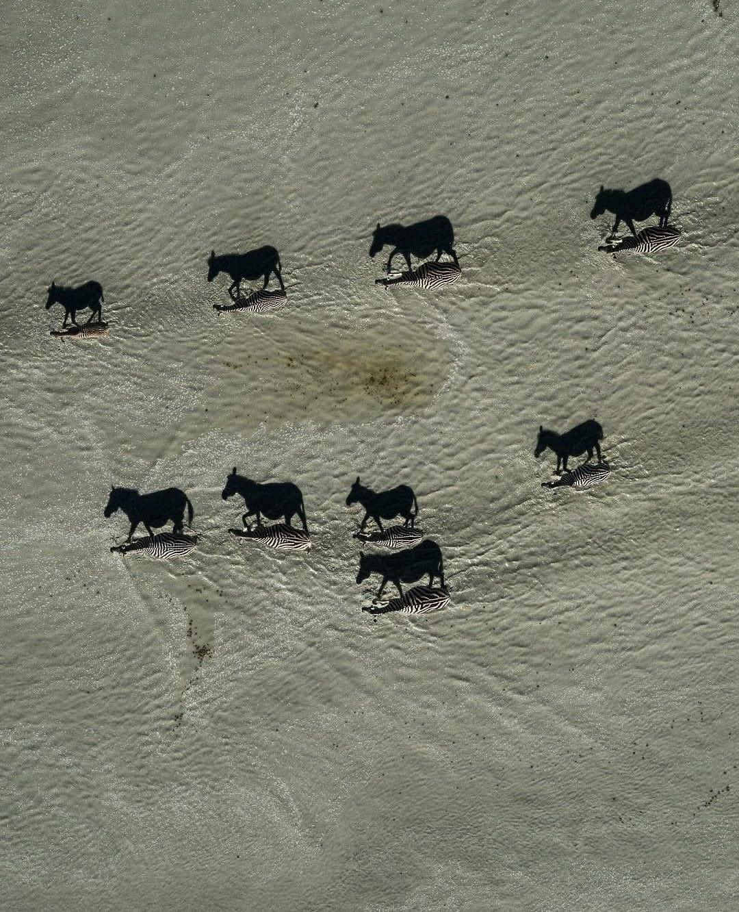

```{r setup, include=FALSE}
library(knitr)
require(tidyverse)
require(sf)
require(sp)

set.seed(453)
# invalidate cache when the package version changes
knitr::opts_chunk$set(tidy = FALSE, echo = FALSE, 
                  message = FALSE, warning = FALSE,
                  out.width = "45%", cache = TRUE, 
                  dev.args=list(bg=grey(0.9), pointsize=11))
options(knitr.table.format = "latex")
options(knitr.kable.NA = "", digits = 2)
options(kableExtra.latex.load_packages = FALSE)
theme_set(theme_bw())
```

# Geodesy

##

\bcolumns
\column{0.62\textwidth}

```{r earth-geometric-models, fig.cap="Geometric models for early earth. Cassinis family postulated that earth was prolate (right). Sir Issac Newton hypothesized that earth, with its rotation around equatorial axis was oblate (left). Newton's concept was later verified in the course of French Geodesic Mission to Equator and to the Lapland (Source: \\url{https://en.wikipedia.org/wiki/French_Geodesic_Mission_to_the_Equator}, \\url{https://en.wikipedia.org/wiki/French_Geodesic_Mission_to_Lapland}).", out.width="84%"}

```

\column{0.35\textwidth}

```{r ellipse-with-auxiliary-circle, fig.cap="An ellipse constructed by compressing a circle of radius a labelled with terms indicating major (a) and minor (b) axis.", out.width="70%"}

```

\ecolumns

\footnotesize
- Flattening (first type; Geodetic reference ellipsoids are specified by giving $\frac{1}{f}$) is defined as,

$$
\small
f = \frac{(a-b)}{a}
$$

## Geodetic datum

\bcolumns
\column{0.7\textwidth}
\footnotesize
- A set of constants specifying the coordinate system used for geodetic control, i.e., for calculating coordinates and elevations of points on the Earth.
- Specific geodetic datums are usually given distinctive names. (e.g., North American Datum of 1983, Old Hawaiian Datum, National Geodetic Vertical Datum of 1929, etc.)
- Characterized by some realization:
  \begin{itemize}
  \scriptsize
  \item a set of passive and/or active physical monuments with published horizontal and/or vertical coordinates
  \end{itemize}

\column{0.3\textwidth}

```{r vlbi-satellite, fig.cap="VLBI satellite.", out.width="98%"}

```

\ecolumns

<!-- In practice the Reference Frame can be considered the same as a datum.  -->

<!-- VLBI is a geometric technique that measures the time difference between the arrival at two earth-based antennas of a radio wavefront emitted by a distant quasar. Using large numbers of time difference measurements from many quasars observed with a global network of antennas, VLBI determines the inertial reference frame defined by the quasars and simultaneously the precise positions of the antennas. The celestial reference frame is defined by VLBI. -->

<!-- (\footnotesize To learn more, refer to the Geospatial Users Group channel on youtube:  https://www.youtube.com/playlist?list=PLNO1Xb_Hjhu8lTkxBE7ixK8p4C5pTP8vP) -->

##

- Reference system is the idealized concepts of an ideal ellipsoid, coordinate system origin, and Earth orientation (Chandler wooble), nutation, precession and plate tectonics.
- Reference frame is the realization of the reference system through observation.
  \begin{itemize}
  \scriptsize
  \item GNSS (Global Navigation Satellite System)
  \item VLBI (Very Long Baseline Interferometry)
  \item SLR
  \end{itemize}
- Definition and implementation of the reference systems and frame is currently entrusted upon the International Earth Rotation and Reference System Service (IERS) 

## Horizontal and vertical datum

- Horizontal/geometric datums
  - 8 basic constants
    - 3 specify the location of the origin of the coordinate system
    - 3 specify the orientation of the coordinate system
    - 2 specify the dimensions of the reference ellipsoid
- Vertical datums
  - Set of fundamental elevations to which other elevations are referred

## Tidal and geodetic datum

\begin{description}
\item[Tidal] Defined by observation of tidal variations over some period of time (MSL, MLLW, MLW, MHW, MHHW, etc.)
\item[Geodetic] Either directly or loosely based on Mean Sea Level at one or more points at some epoch (NGVD 29, NAVD 88, IGLD85, etc.)
\end{description}

## The Geoid

- An equipotential surface to which gravity is normal and most closely approximates Mean Sea Level over the entire Earth.

```{r geoid-ellipsoid-relationship, fig.cap="Relationship between the Ellipsoid and the Geoid. H = Orthometric height (NAD 88), h = Ellipsoid height (NAD 83 (2011)), N = Geoid height (GEOID12A/B)", out.width="70%"}

```

# Geospatial data

## Spatial data

- \alert{Spatial data} describes the absolute and relative location of geographic features.
- Spatial data consists of points, lines, polygons or other geographic and geometric data primites that we can map by location.
- Two forms of spatial data each providing information connected to geographical locations are:
  - Vector data
  - Raster data
- Data describing the characteristics of geographical features included in the spatial data is called \alert{attribute data}.
  - in combination with spatial information, attribute of geographical features provide meaningful insights from a map.
  - attributes could relate to: characteristics of soil, soil type, elevation, rock type, vegetation type, thematic summary relating to certain aspects of the crop/vegetation. 

##

```{r spatial-raster-data, fig.cap="An exported form of vector data stored as Shapefile showing areas of Sudurpaschim province of Nepal.", out.width="55%"}
knitr::include_graphics("../images/sudurpaschim_LU_labelled.png")
```

\footnotesize
- Refer to '../data/artificial_points_polygon' directory for demonstration.

##

- In vector data model, feature boundaries are converted to straight-sided polygons that approximate the original regions. These polygons are encoded by determining the coordinates of their vertices, called points or nodes, which can be connected to form lines or arcs.
- Topological coding includes "intelligence" in the data structure relative to the
spatial relationship (connectivity and adjacency) among features
  - it keeps track of which arcs share common nodes and what polygons are to the left and right of a given arc
- Vector data encoding allows for spatial operations such as overlay analysis, buffering, and network analysis.
- Allows for lower data volume, better spatial resolution, and the preservation of topological data relationships (allowing efficient network analysis)

## Raster data

- Raster systems generally have simpler data structures
  - afford greater computational efficiency in such operations as overlay analysis
  - represent features having high spatial variability and/or 'blurred boundaries' (e.g., between pure and mixed vegetation zones) effectively
- Limitations
  - volumes are relatively greater
  - spatial resolution of the data is limited to the size of the cells comprising the raster
  - topological relationships among features are more difficult to represent
- Digital remote sensing images are collected in a raster format, accordingly they are inherently compatible with other sources of information in a raster domain
- Image processing procedures as automated land cover classification result in the creation of interpreted or derived data files in a raster format. These derived data are again inherently compatible with the other sources of data represented in a raster format.

##

\bcolumns
\column{0.6\textwidth}

```{r zebra-zoomed-out, out.width="64%"}

```

\column{0.4\textwidth}

```{r zebra-zoomed-in, out.width="62%"}

# Vertical aerial photograph showing camels that cast long shadows under a low sun angle in Saudi Arabia. Black-and-white rendition of color original.
```

\ecolumns

## Free gis data

https://freegisdata.rtwilson.com/

## Spatial dataset: An example

```{r example-data, out.width="60%"}
p1 = st_point(c(7,52))
p2 = st_point(c(-30,20))

# let's set the projection to longlat with WGS84, epsg code 4326
sfc = st_sfc(p1, p2, crs = 4326) # crs is equivalent to "+init=epsg:4326 +proj=longlat +ellps=WGS84 +datum=WGS84 +no_defs+towgs84=0,0,0"; this information is obtained with
# CRS("+init=epsg:4326")

# # # setting crs is done by
# sfc %>% 
#   st_transform(crs = "+init=epsg:3857") # mercator projection, google maps/osm maps tiles
# 
# sfc %>% 
#   st_transform(crs = "+init=epsg:4269") # longlat projection with NAD83

ggplot() +
  geom_sf(data = st_geometry(sfc)) +
  theme_minimal() +
  coord_sf(crs = "+init=epsg:3857")
```

##

https://erinbecker.github.io/r-raster-vector-geospatial/aio.html

# Bibliography

## References
