```{r setup, include=FALSE}
library(knitr)
require(tidyverse)
set.seed(453)
# invalidate cache when the package version changes
knitr::opts_chunk$set(tidy = FALSE, echo = FALSE, 
                  message = FALSE, warning = FALSE,
                  out.width = "45%", cache = TRUE, 
                  dev.args=list(bg=grey(0.9), pointsize=11))
options(knitr.table.format = "latex")
options(knitr.kable.NA = "", digits = 2)
options(kableExtra.latex.load_packages = FALSE)
theme_set(theme_bw())
```

# Remote sensing

## Background

\begin{columns}[T, onlytextwidth]
\column{0.6\textwidth}

\begin{itemize}
\item History may be traced back to the first pre-historic explorer who climbed a nearby hill to study the lay of the land.
\item During first half of 19th century, Louis Jacques Mande Daguerre and Joseph Nicephore Niepc invented a photographic device, a foundation for modern photography and a means to record a remotely sensed image.
\item In 1859, Gaspard Félix Tournachon Clateu (later known in the literature as Félix Nadar) took the first known aerial image from a balloon.
\end{itemize}
\column{0.4\textwidth}

```{r historical-landsat, fig.cap="Landsat MSS image acquired September 20, 1984 over the Nile Delta area.", out.width="88%"}
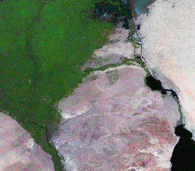
```

\end{columns}

## Meaning

\bcolumns
\column{0.65\textwidth}
\footnotesize
- Remote sensing provides data at a synoptic global level that is impossible to replicate with in situ measurements.
- Remote sensing imagery used for the identification of earth surface features is dependent upon measurable variations in electromagnetic field strength. Variations are mainly three types:
  \begin{enumerate}
  \scriptsize
  \item Spectral
  \item Spatial
  \item Temporal
  \end{enumerate}
- Simply, the measurement of an object by a device that is not in physical contact is \alert{remote sensing}.
  \begin{itemize}
  \scriptsize
  \item Active remote sensing involves transmission and reception of radiation, such as radar/lidar (CLOUDSAT/CALIPSO)
  \item Passive remote sensing only receives radiation from a target of interest, such as MODIS, Sentinel, Landsat and majority of earth orbiting sensor systems
  \end{itemize}

\column{0.35\textwidth}

```{r active-passive-remote, fig.cap="Passive (left) and active (right) remote sensing.", out.width="95%"}
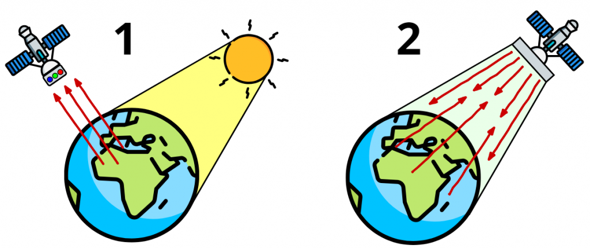
```

\ecolumns

##
  
- The principal source for the images is the electromagnetic (EM) energy spectrum.
- The spectral bands are grouped according to energy per photon ranging form the gamma rays (highest energy) to the radio waves (lowest energy)

```{r electromagnetic-spectrum, fig.cap="Electromagnetic spectrum", out.width="85%"}
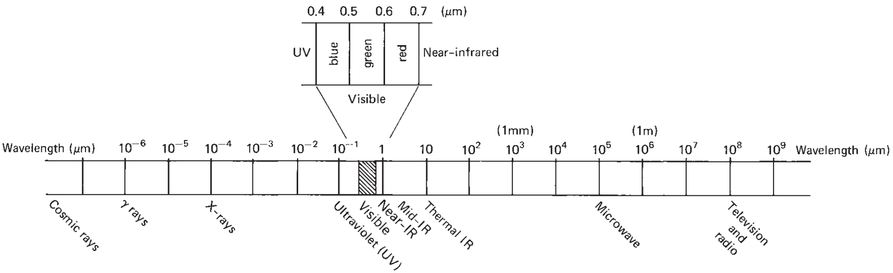
```

##

\bcolumns
\column{0.33\textwidth}

```{r gamma-ray-imaging, fig.cap="$\\gamma$-ray imaging is used in nuclear medicine and astronomical observations.", out.width="70%"}
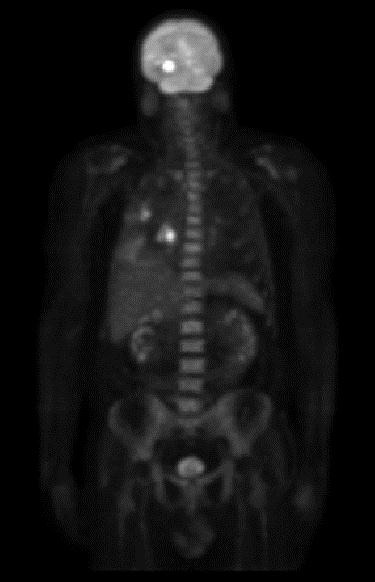
```

\column{0.33\textwidth}

```{r x-ray-imaging, fig.cap="x-ray imaging is widely used in medical imaging as well as industrial imaging (of circuit boards, for example).", out.width="60%"}
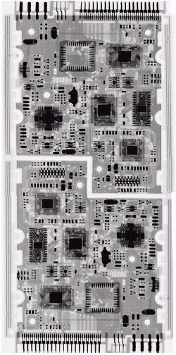
```

\column{0.33\textwidth}

```{r infrared-imaging, fig.cap="Infrared band imaging provides an indication of thermal profile of a scene.", out.width="75%"}
knitr::include_graphics("../images/Infrared_dog.jpg")
```

\ecolumns

<!-- \footnote[frame]{Synoptic: Pertaining to or affording an overall view; referring to the use of meteorological data obtained simultaneously over a wide area for the purpose of presenting a comprehensive and nearly instantaneous picture of the state of the atmosphere} -->

(\scriptsize Refer to Section 1.2 of @lillesand2015remote for "Energy sources and radiation principles" and 1.3 and 1.4 for detailed exploration of theoretical basis of electromagnetic wave information generation.)

<!-- Spectral: These depend on the physical conditions of the surface cover type being sensed. As the electromagnetic energy from the sun strikes the cover type it will either be reflected back into space, absorbed and then emitted at different wavelength, transmitted through the material (and lost for measurement purposes) or scattered depending on the geometry and physiology or physical make-up of the cover type. -->

<!-- (Refer to FAO report on remote sensing for more contents: https://www.fao.org/3/ca6422en/ca6422en.pdf) -->

## Earth energy budget

```{r earth-energy-budget, fig.cap="Earth's energy budget.", out.width="70%"}
knitr::include_graphics("../images/earth_energy_budget_satellite-infrared-radiation-fluxes.jpg")
```

##

- As developments in novel image processing algorithms and community around use and communication of image data continue, scientific value of remotely sensed data grow to the extent that never anticipated information are extracted.
- However, there are tradeoffs between the local detail of the measurements (radiometric resolution, number of spectral bands) and the spatial scale of the area being measured.
- Remote sensing is a more rapid means to sample multiple crop parameters from spectral indices such as NDVI.
  - Productive canopy surface (LAI)
  - Productivity and yield potential
  - Photosynthetic capacity

##

```{r nasa-uav-remote-sensing, fig.cap="Uninhabited aerial vehicles (UAVs) used for environmental applications of remote sensing. (a) NASA’s Ikhana UAV, with imaging sensor in pod under left wing.", out.width="65%"}
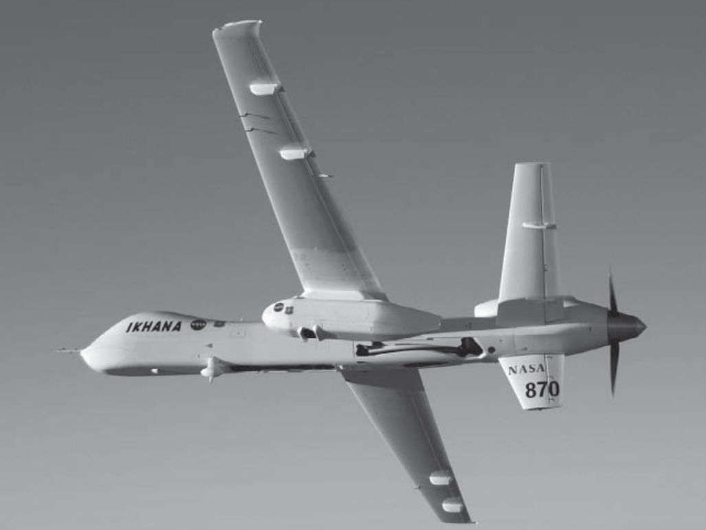
```

## Landsat imagery

- 2022 marks 50th anniversary of the continuous planetary land coverage gathered by the Landsat imaging system.
- Instruments on the Landsat satellites have acquired millions of images and can be viewed through the U.S. Geological Survey (USGS) "EarthExplorer" \footnote[frame]{https://earthexplorer.usgs.gov/} website. 
- Current version of the landsat (Landsat-9) was launched in September 27, 2021
- Currently Landsat program is managed jointly by:
  - NASA
  - USGS
- Landsat 7 data has eight spectral bands with spatial resolutions ranging from 15 to 60 m (49 to 197 ft); the temporal resolution is 16 days.
- Landsat images are usually divided into scenes for easy downloading. Each Landsat scene is about 115 miles long and 115 miles wide (or 185 kilometers long and 185 kilometers wide).
- Landsat imagery is coarse in spatial resolution compared to using other remote sensing methods, such as imagery from airplanes.

## Applications of Landsat imagery

- Agriculture risk management
- Government mapping
- Agricultural water use monitoring
- Global security monitoring
- Support for fire management
- Detection of forest fragmentation
- Detection of forest change
- World agriculture supply and demand estimates
- Vineyard management and water conservation
- Flood mitigation mapping
- Agricultural commodities mapping
- Waterfowl habitat mapping and monitoring
- Coastal change analysis
- Forest health monitoring
- Wildfire risk assessment
- Fisheries, forestry, shrinking inland water bodies, fire damage, glacier retreat, urban development, and discovery of new species

## Image bands, resolution and features of Landsat

```{r landsat-bands}
# require(rvest)
# landsat_wiki <- read_html(url("https://en.wikipedia.org/wiki/Landsat_program"))
# 
# landsat_wiki_tables <- landsat_wiki %>% 
#   html_elements("table")

# landsat_wiki_tables[[4]] %>% 
#   html_table() %>% 
#   write_csv("../data/landsat7_etm_plus_spatial_spectral_resolution.csv", "")

# landsat_wiki_tables[[5]] %>%
#   html_table() %>%
#   write_csv("../data/landsat8_oli_tirs_spatial_spectral_resolution.csv", "")

read_csv("../data/landsat8_oli_tirs_spatial_spectral_resolution.csv", show_col_types = FALSE) %>% 
  knitr::kable(booktabs = TRUE, caption = "Landsat 8 Operational Land Imager (OLI) and Thermal Infrared Sensor (TIRS). TIRS bands are acquired at 100 meter resolution, but are resampled to 30 meter in delivered data product") %>% 
  kableExtra::kable_styling(font_size = 8) %>% 
  kableExtra::column_spec(column = 1:3, width = c("14em", "10em", "10em"))
```

##

```{r band-comparison-lansat89-landsatnext, fig.cap="Source: \\url{https://upload.wikimedia.org/wikipedia/commons/8/88/L8and9-to-LandsatNext-BandComparison.png}", out.width="65%"}
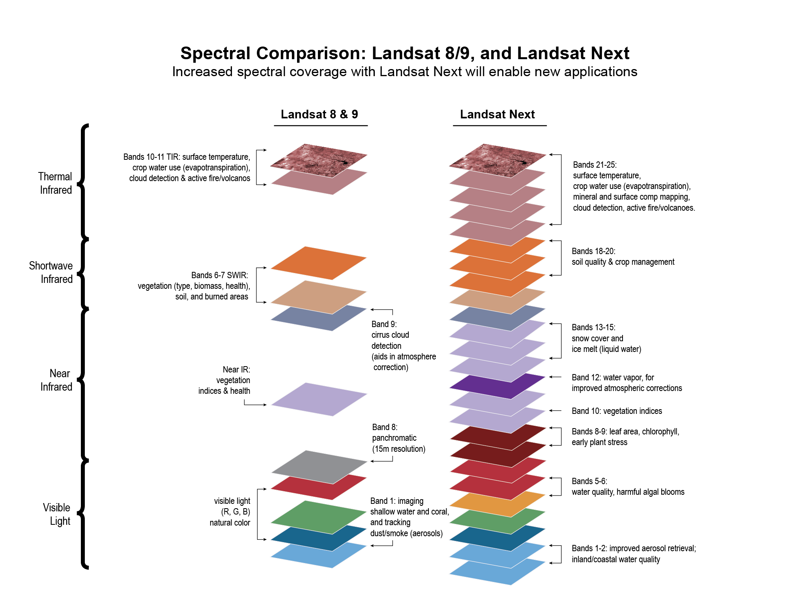
```

## Moderate Resolution Imaging Spectroradiometer (MODIS)

\small
- An imaging sensor built by Santa Barbara Remote Sensing that was launched into Earth orbit by NASA in 1999 on board the Terra (EOS AM) satellite, and in 2002 on board the Aqua (EOS PM) satellite.
  \begin{itemize}
  \footnotesize
  \item Wide spectral band
  \item High frequency and temporal coverage
  \end{itemize}
- Instrument captures data of 36 spectral bands and has a 2330 km wide viewing swath, seeing every point on earth every 1-2 days.
- Mostly useful for measuring atmospheric variables, including cloud cover, the size of cloud droplets in both liquid water and ice particles, aerosols and pollution from natural and man-made sources like industry emissions, dust storms, volcanic eruptions and forest fires.

<!-- ## ARGOS-4 -->

<!-- literature source: https://www.nesdis.noaa.gov/next-generation/argos-4-launch -->
<!-- ARGOS-4 launch is set for September 29, 2022 -->

<!-- Once in orbit, Argos-4 will join a network of other Argos instruments onboard other polar orbiting satellites to collect a variety of data from both stationary and mobile transmitters around the world. This vital information helps provide a better understanding of Earth’s physical and biological environment, including its weather and climate, biodiversity and ecosystems, as well as assist with maritime security, offshore pollution, and humanitarian assistance. -->

## Data description -- Metadata

\begin{figure}
\begin{columns}[T,onlytextwidth]

  \column{.6\linewidth}
  \begin{center}
  \includegraphics[width=0.35\linewidth]{../images/2020-09-01-MODIS-hdf-file-info.jpg}
  \end{center}
  
  \column{.4\linewidth}
  \caption{\newline HDF files are self describing. All elements (the file itself, groups and datasets) can have associated meta-data that describes the information contained within the element.}
  \label{fig:metadata-modis}
  
  \end{columns}
\end{figure}

\begin{figure}
\begin{columns}[T,onlytextwidth]

  \column{.7\linewidth}
  \begin{center}
  \includegraphics[width=0.75\linewidth]{../images/MCD43D09.A2022310.006.2022322075329_south_asia_focus_albedo.png}
  \end{center}
  
  \column{.3\linewidth}
  \caption{\newline Bidirectional Reflectance Distribution Function and Albedo (BRDF/Albedo) Model Parameter dataset (clipped to display South Asian region) is produced daily using 16 days of Terra and Aqua Moderate Resolution Imaging Spectroradiometer (MODIS) data at 30 arc second (1,000 meter) resolution. The pixels represented in binary are infact derived from unscaled values (by QGIS).}
  \label{fig:modis-albedo-layer}
  
  \end{columns}
\end{figure}

```{r}

# An HDF file contains layers of raster with spectral bands, meta information and CRS.

# To access HDF, you can use 3 different R packages.
# 
# ncdf4: This package works for both HDF4 and HDF5. (Might needs to be built using source? For help and troubleshooting refer to: https://hdfeos.org/software/r.php)
# rgdal: This package works for both HDF4 and HDF5. This is convenient for datasets that have the characteristics of raster images and for data conversion between HDF and GeoTIFF.
# h5: This package works only for HDF5.

# Since the file sizes are large, better not import the hdf files in R.
# but import in QGIS and export in print layout format
# for a file (MCD43D09.A2022310.006.2022322075329.hdf) rendered in print layout using QGIS, following is layer information

# SDS name: Global_BRDF_Albedo_Parameter3_Band3
# Description: BRDF model parameter for geo kernel of band 3
# Units: N/A
# Data type: 16-bit signed integer
# Fill value: 32767
# No data value: N/A
# Valid range: 0 to 32766
# Scale factor: 0.001

# The MCD43D09 Version 6 Bidirectional Reflectance Distribution Function and Albedo (BRDF/Albedo) Model Parameter dataset is produced daily using 16 days of Terra and Aqua Moderate Resolution Imaging Spectroradiometer (MODIS) data at 30 arc second (1,000 meter) resolution. Data are temporally weighted to the ninth day which is reflected in the Julian date in the file name. This Climate Modeling Grid (CMG) product covers the entire globe for use in climate simulation models. Due to the large file size, each MCD43D product contains just one data layer. Each of the three model parameters (isotropic, volumetric, and geometric) for each of the MODIS bands 1 through 7 and the visible, near-infrared (NIR), and shortwave bands included in MCD43C1 are stored in a separate file as MCD43D01 through MCD43D30.
# 
# MCD43D09 is the BRDF geometric parameter for MODIS band 3. The geometric parameter, in conjunction with the isotropic and volumetric parameters, is used to derive the BRDF/Albedo values for MODIS band 3.

# Collection
# Characteristic	Description
# Collection	Combined MODIS
# DOI	10.5067/MODIS/MCD43D09.006
# File Size	~134.4 MB
# Temporal Resolution	Daily
# Temporal Extent	2000-02-16 to Present
# Spatial Extent	Global
# Coordinate System	Geographic Latitude and Longitude
# Datum	N/A
# File Format	HDF-EOS
# Geographic Dimensions	Global

# Granule
# Characteristic	Description
# Number of Science Dataset (SDS) Layers	1
# Columns/Rows	43200 x 21600
# Pixel Size	~1000 m
```

# Acquiring remotely sensed data

## Landsat Missions of USGS

\begin{columns}[T, onlytextwidth]

\column{0.5\textwidth}

```{r usgs-portal, fig.align="center", out.width="98%"}

# pdftools::pdf_convert("../../geoinformatics-pages/Landsat 8 _ U.S. Geological Survey.pdf",
#                       pages = 1:2,
#                       filenames = paste0("../images/usgs_official_portal_p", 1:2, ".png"), 
#                       format = "png", dpi = 250)
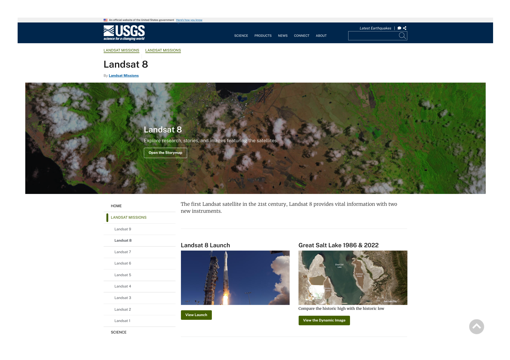
```

\column{0.5\textwidth}


```{r earthexplorer-portal, fig.align="center", out.width="98%"}

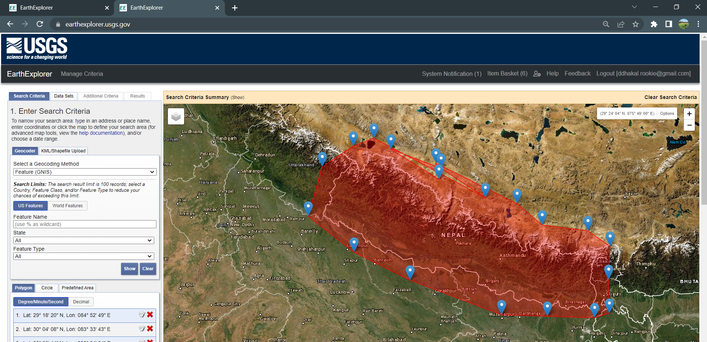
```

\end{columns}

## Sentinel mission of NASA

```{r sentinel-nasa-portal, fig.align="center", out.width="85%"}
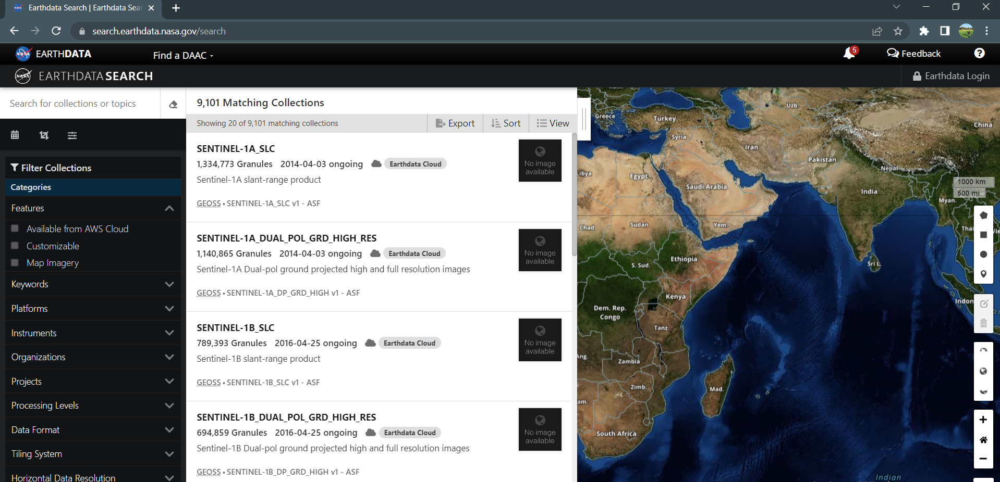
```

# Image and use of photographic image in scene measurement 

## Image


\begin{block}{Casual definition}
Is a visual representation of something. It can be two-dimensional, three-dimensional, or somehow otherwise feed into the visual system to convey information.
\end{block}

\begin{block}{Mathematical definition}
An image is a two-dimensional function f(x, y), where x and y are the spatial (plane) coordinates, and the amplitude of f at any pair of coordinates (x, y) is called the intensity of the image at that level.
\end{block}

\begin{description}
\item[Digital image] If x, y and the amplitude values of f are finite and discrete quantities, we call the image a digital image. A digital image is composed of a finite number of elements called pixels, each of which has a particular location and value.
\end{description}

##

- An image is generic term for any pictorial representation of data.
  - a pictorial record from a "thermal scanner" (electronic scanner) would be called a "thermal image".
- Not all images are photographs. (Try calling a 'thermal image' a 'thermal photograph'!)
- Spectral characteristics are not always fully evaluated in visual interpretation efforts because of the limited ability of the eye to discern tonal values on an
image and the difficulty of simultaneously analyzing numerous spectral images.
- In applications where spectral patterns are highly informative, it is therefore preferable to analyze digital, rather than pictorial.

## Image acquisition

\scriptsize
- Images are generated by the combination of an \alert{illumination source} and the reflection or absorption of energy from that source by the elements of the \alert{scene} being imaged.
- Imaging sensors are used to transform the illumination energy into digital images.

<!-- Each sensor transforms the incoming energy into voltage by the combination of the input electrical power and the sensor material that is responsive to the particular type of energy being detected. -->

```{r imaging-sensors, fig.cap="An example of the digital image acquisition process. Stages: (a) Energy ('illumination') source. (b) An element of a scene. (c) Imaging system. (d) Projection of the scene onto the image plane. (e) Digitized image.", out.width="60%"}
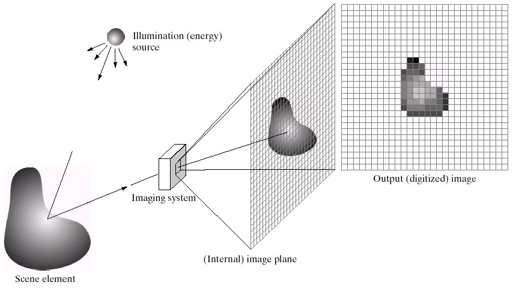
```


<!-- Given a continuous image, f(x,y), digitizing the coordinate values is called sampling and digitizing the amplitude (intensity) values is called quantization. -->

## Area calculation

- Process of measuring areas using aerial photographs can be accomplished in many ways.
- Accuracy of area measurement is a function of not only the measuring device used, but also the degree of image scale variation due to relief in the terrain and tilt in the photography.
  - accurate measurements are obtained from vertical photos of areas of low relief
- Simple scales may be used to measure the are of simply shaped features
  - area of a rectangular field can be determined by simply measuring its length and width
  - area of circular feature can be computed after measuring its radius or diameter

##
  
**Numerical problem**
  
A rectangular agricultural field measures 8.65 cm long and 5.13 cm wide on a vertical photograph having a scale of 1:20000. Find the area of the field at ground level.

$\longrightarrow$

$\text{Ground length} = \text{Photo length} \times \frac{1}{S} = 0.0865 m \times 20,000 = 1730 m$

$\text{Ground width} = \text{Photo width} \times \frac{1}{S} = 0.0513 m \times 20,000 = 1026 m$

$\text{Ground area} = 1730m \times 1026m = 1,774,980m^2 = 177 ha$

##

\bcolumns
\column{0.5\textwidth}
\footnotesize
- For measuring irregularly shaped features, a simplest technique uses transparent grid overlay consisting of lines forming rectangles or squares of known area.
- The grid is placed over the photograph and the area of a ground unit is estimated by counting the number of grid units that fall within the unit to be measured.

```{r transparent-dot-grid, fig.cap="Transparent dot grid overlay.", out.width="70%"}
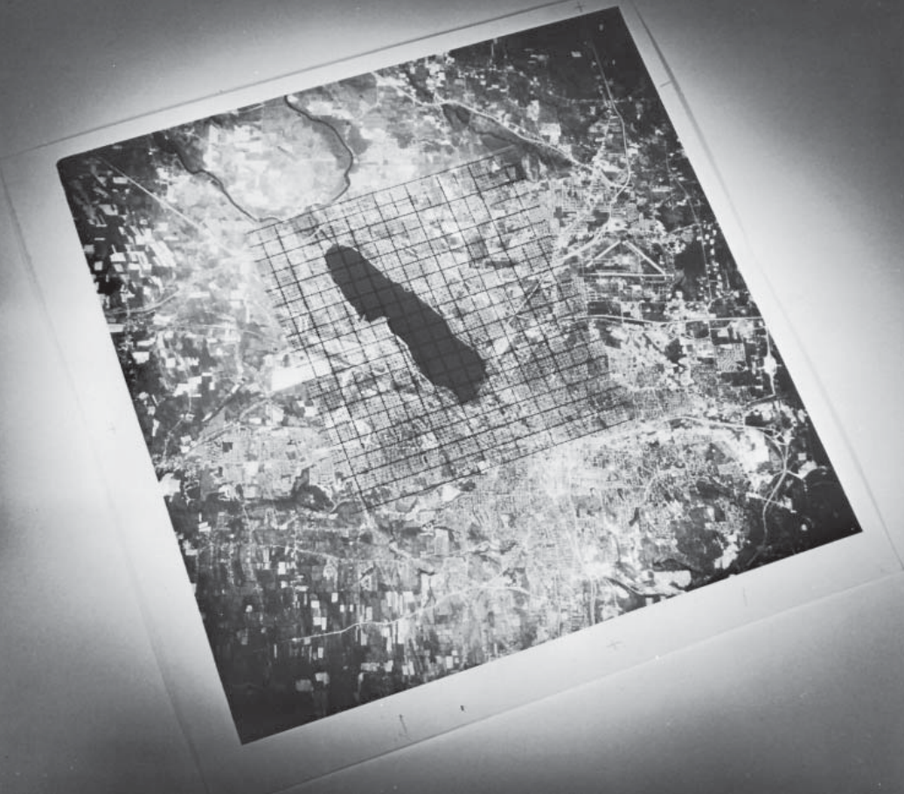
```

\column{0.5\textwidth}

\footnotesize
\textbf{Numerical problem}

A flooded area is covered by 129 dots on a $25\mathrm{-dot/cm^2}$ grid on a 1:20,000 vertical aerial photograph. Find the ground area flooded.

$\longrightarrow$

$\text{Dot density} = \frac{\mathrm{1~cm^2}}{\mathrm{25~dots}} = 16,000,000 \mathrm{~cm^2/dot} = 0.16 \mathrm{~ha/dot}$

$\text{Ground area} = 129\mathrm{~dots} \times 0.16 \mathrm{~ha/dot} = 20.6\mathrm{~ha}$

\ecolumns

# Image processing

##

\begin{figure}
  \begin{columns}[T,onlytextwidth]
  \column{.8\linewidth}
  \begin{center}
  \includegraphics[width=0.48\linewidth]{../images/features_of_digital_image.PNG}
  \end{center}
  
  \column{.2\linewidth}
  \caption{\newline\tiny The image shown in upper left is actually composed of a two-dimensional array of discrete picture elements, or pixels. They intensity of each pixel corresponds to the average brightness, or radiance, measured electronically over the ground area corresponding to each pixel. A total of 500 rows and 400 columns of pixels are shown. Whereas the individual pixels are virtually impossible to discern in first image, they are readily observable in the enlargements shown in upper right (100 row x 80 column) and lower left (10 row x 8 column). These enlargements correspond to sub-areas located near the center of the first image. In the lower right is shown the individual \textit{digital number (DN)} also referred to as 'brightness value' or 'pixel value' -- corresponding to the average radiance measured in each pixel shown on the left. These values result from quantizing the original signal from the sensor into positive integer values using a process called 'analog-to-digital (A-to-D) signal conversion'.}
  \label{fig:features-digital-image}
  
  \end{columns}
\end{figure}

## Preprocessing 

- To remove noise and increase the interpretability of image data (essential when a time series of imagery is used or when when multiple image operation such as join is required to account for an area encompassed by many images to make these images compatible spatially and spectrally)
- All images after image preprocessing should appear as if they were acquired from the same sensor (Hall et al. 1991).
- Image processing sensors are usually categorized into levels (0, 1A, 1B, 2A, 2B, 3A, 3B with image quality gradually increased). For example, for most sensors, level 3A means that radiometric correction, geometric correction and orthorectification have been processed for the images.
- Factors such as seasonal phenology, ground conditions and atmospheric conditions can contribute to variability in multi-temporal spectral responses that may have little to do with the remote sensed objects themselves (Song and Woodcock 2003)

##

- Image preprocessing commonly comprises a series of operations,
  - including but not limited to bad lines replacement,
  - radiometric correction,
  - geometric correction,
  - image enhancement and masking (e.g. for clouds, water, irrelevant features) although variations may exist for images acquired by different sensors.
  - bad line replacement (fills in missing lines with the line above, below or with an average of the two) to determine the overall quality of the images (e.g. missing data lines) through visually previewing the images band-by-band
  - cloud imposes a big noise in mapping vegetation cover for identifying and thus has to be removed or masked.
    - neural network to detect cloud in SPOT VEGETATION images
    - cloud-free space shuttle photograph to detect and remove (mask) unwanted cloud covers in Landsat TM scenes  

## Image pre-processing: Radiometric correction

- radiometric correction normally involves the process of correcting radiometric errors or distortions of digital images to improve the fidelity of the brightness values. radiometric correction methods (absolute and relative correction):
  - complex mathematical models that describe the main interactions involved (certain parameters (i.e. the atmospheric composition) must be known before applying them). 
  - methods based on the observations of reference targets (e.g. water or desert land) whose radiometry is known.

## Image pre-processing: Geometric correction

- geometric correction to avoid geometric distortions from a distorted image and is achieved by establishing the relationship between the image coordinate system and the geographic coordinate system using the calibration data of the sensor, the measured data of position and altitude and the ground control points

\begin{columns}[T, onlytextwidth]
\column{0.5\textwidth}

```{r geometric-fault-example, fig.align='center', out.width="70%"}
# magick library is well documented at: https://www.imagemagick.org/Magick++/Documentation.html
checkerboard <- magick::image_read("../images/irrigating_farmer.png")
# checkerboard %>% 
#   magick::image_attributes()

checkerboard <- checkerboard %>% 
  magick::image_resize(filter = "Cubic", geometry = "500x") # refer to filter_types() for options

checkerboard
```

\column{0.5\textwidth}

```{r geometric-fault-example-correct, fig.align='center', out.width="70%"}

# checkerboard %>% 
  # magick::image_convert(matte = FALSE) # matte false disables transparency


checkerboard %>% 
    magick::image_distort(distortion = "Affine",
                          coordinates = c(30, 40, 40, 25,
                                          70, 240, 20, 180),
                          bestfit = FALSE)

# first_coord <- seq(0, 50, by = 5)
# second_coord <- first_coord
# 
# checkerboard_dist_frames <- map2(.x = first_coord, .y = second_coord,
#      .f = ~magick::image_distort(checkerboard, distortion = "Affine",
#                                  coordinates = c(0, 0, .x, .y))) 

# # checkerboard_dist_frames can only be converted or used in `magick` when used as single or multiple vector element for example following WORKS with any modification:
# c(checkerboard_dist_frames[[1]],
#   checkerboard_dist_frames[[2]],
#   checkerboard_dist_frames[[3]])
  
# magick::image_write_video("../images/checkerboard_distort_movie.mp4", framerate = 20)
  
```

\end{columns}

## Image pre-processing: Image enhancement

- image enhancement is aimed to emphasize and sharpen particular image features (i.e. particular species of vegetation) for visualization purpose
  - gray scale conversion,
  - histogram conversion,
  - color composition,
  - color conversion between red-green-blue (RGB), and
  - hue–saturation–intensity transform (HSI), etc.

# Bibliography

## References

- Refer to youtube video on 'Overview of Remote Sensing':  https://www.youtube.com/watch?v=jVXgWGK9Kr8
