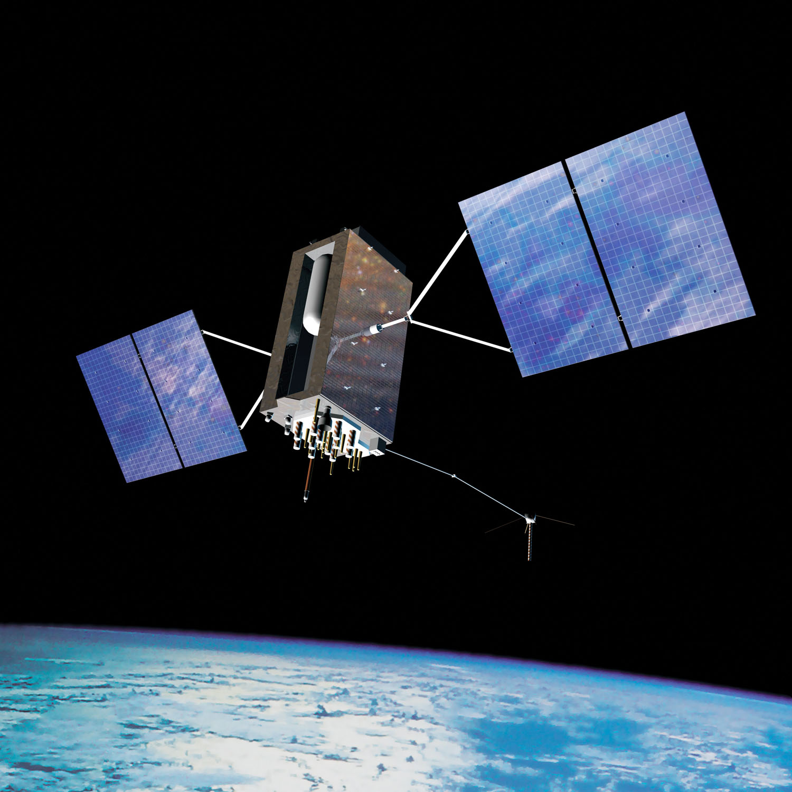
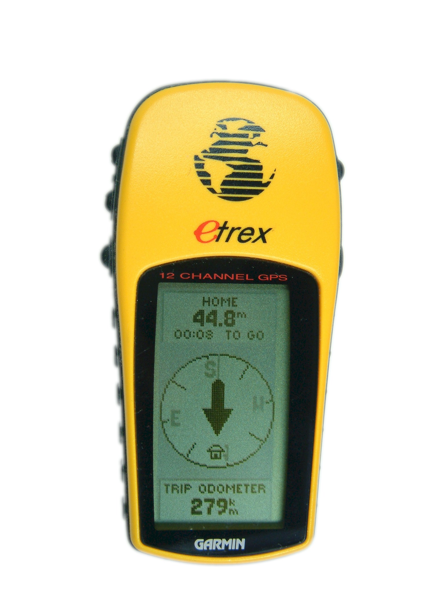

```{r setup, include=FALSE}
library(knitr)
require(tidyverse)
set.seed(453)
# invalidate cache when the package version changes
knitr::opts_chunk$set(tidy = FALSE, echo = FALSE, 
                  message = FALSE, warning = FALSE,
                  out.width = "45%", cache = TRUE, 
                  dev.args=list(bg=grey(0.9), pointsize=11))
options(knitr.table.format = "latex")
options(knitr.kable.NA = "", digits = 2)
options(kableExtra.latex.load_packages = FALSE)
theme_set(theme_bw())
```

# Global positioning system

##

- Global navigation satellite system (GNSS) determines the location of field-observed reference data.
- GNSS has applications in
  - navigating aircraft during sensor data acquisition
  - geometrically correcting and referencing raw image data
- US Global Positioning System (GPS) was originally developed for military purposes, but soon became ubiquitous in many civil applications worldwide -- vehicle navigation, surveying, locaion based services and cellular phones.
  - The system consists of at least 24 satellite rotating around the earth in precisely known orbits
  - Typically, these satellites revolve around the earth approximately once every 12 hours, at an altitude of approximately 20,200 km.

##

- With their positions in space precisely known at all times, the satellites transmit time-encoded radio signals that are recorded by ground-based receivers and can be used to aid in positioning and navigation.
- A comprehensive European GNSS constellation, _Galileo_ as well as the Russian _GLONASS_ and Chinese _Compass_ system are operational counterparts to the US GPS system.

##

\bcolumns
\column{0.6\textwidth}
\footnotesize
- The means by which GNSS signals are used to determine ground positions is called _satellite ranging_.
- Conceptually, it involves measuring the time required for signals transmitted by at least four satellites to reach the ground receiver.
- Knowing that the signals travel at the speed of light ($\mathrm{3 \times 8^8 m/sec}$ in vaccum), the distance from each satellite to the receiver can be computed using a form of three-dimensional triangulation.
- GNSS measurements are potentially subject to sources of errors such as clock bias, uncertainties in the satellite orbits (satellite ephemeris errors) and errors due to atmospheric conditions.
- In recent years, there have been efforts to improve the accuracy of GNSS positioning through the development of regional networks of high-precision base stations, generally referred to as satellite-based augmentation systems (SBAS).

\column{0.4\textwidth}

```{r us-gps-satellite, fig.cap="The U.S. Space Force's Global Positioning System was the first global satellite navigation system and was the first to be provided as a free global service. Source: \\url{https://en.wikipedia.org/wiki/Satellite_navigation}", out.width="72%"}

```

\ecolumns

##

\bcolumns
\column{0.3\textwidth}

```{r gps-navigation-device, fig.cap="", out.width="70%"}

```

\column{0.7\textwidth}
\small

**Applications of GPS navigation**

- Automobile
- Air navigation usually having a moving map display and often connected to the autopilot for en-route navigation
- Boats and ships (Maritime GNSS)
- Construction and mining
- Precision agriculture --  Agricultural equipment may use GNSS to steer automatically, or as a visual aid displayed on a screen for the driver. This is useful for controlled traffic and row crop operations and when spraying. Harvesters with yield monitors can also use GNSS to create a yield map.
- Cycling and sports for touring and plotting the course
- Exploration, hiking and climbing make use of GNSS to enable locating precisely in isolated areas.
- Spacecraft GNSS

\ecolumns

# Bibliography

## References
