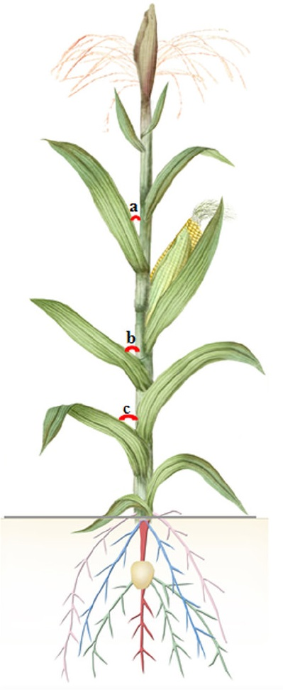
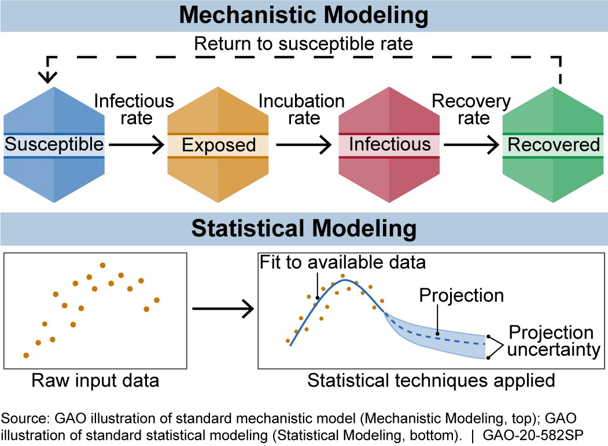
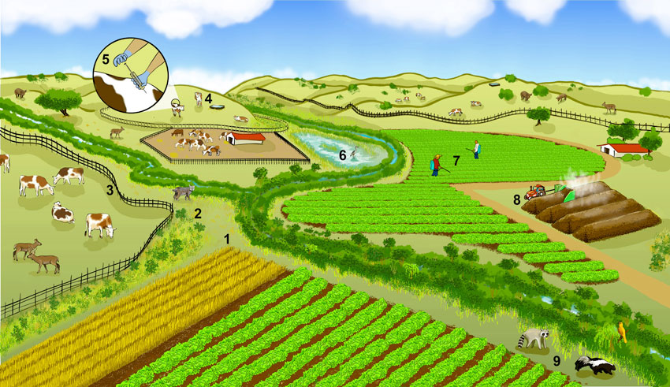
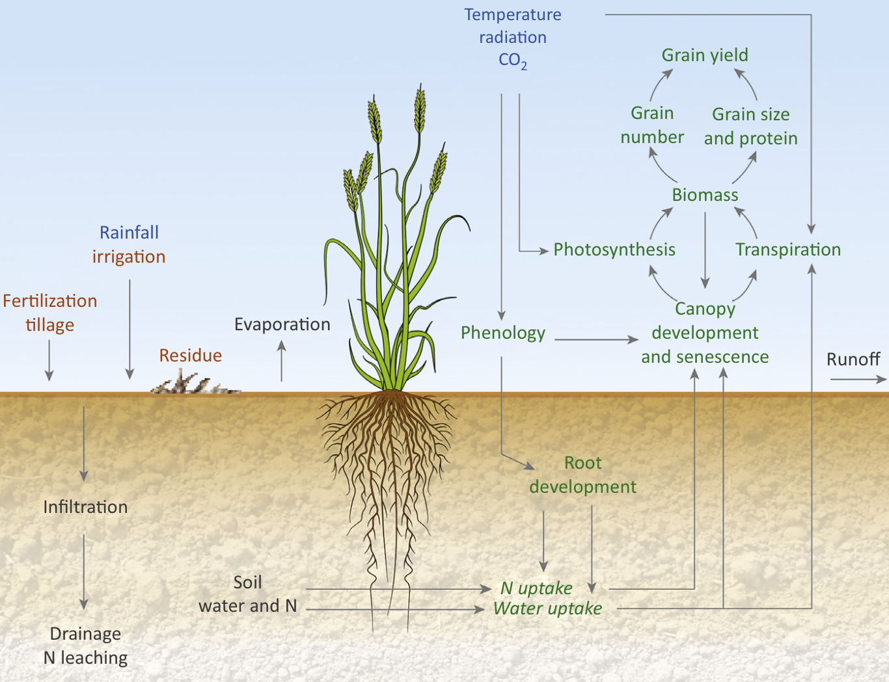
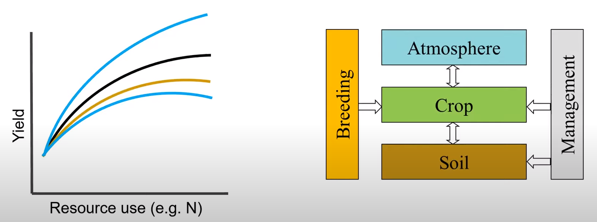
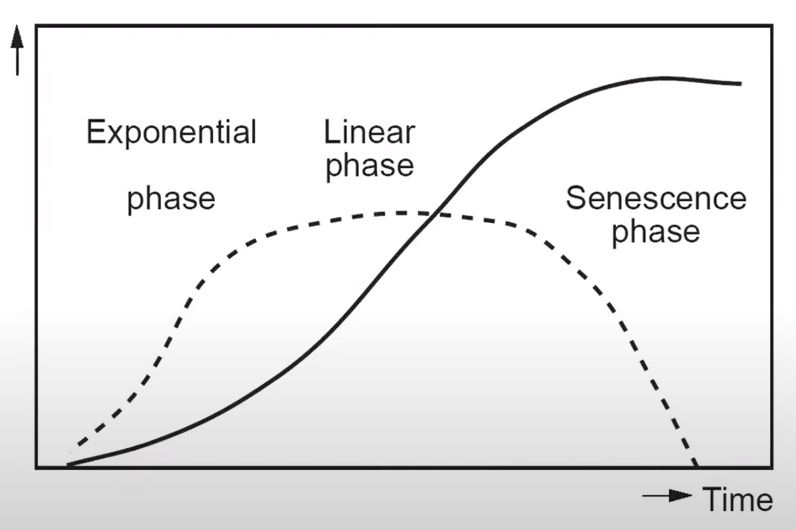
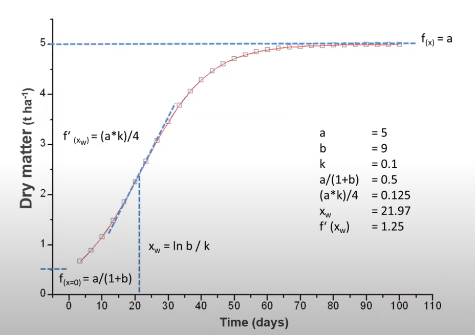
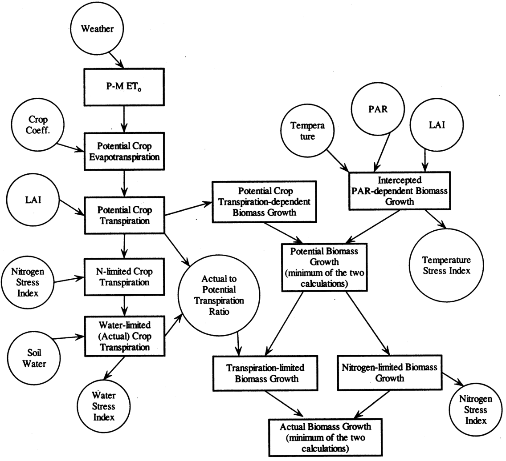
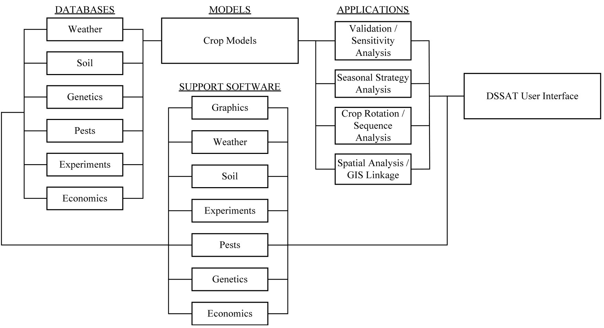
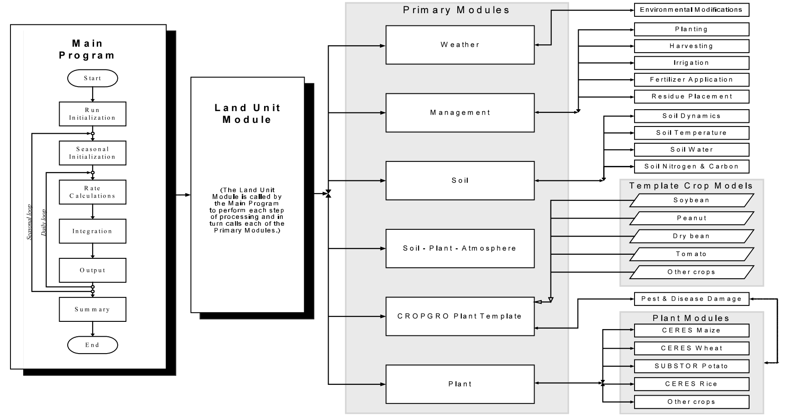

```{r setup, include=FALSE}
library(knitr)
require(tidyverse)
set.seed(453)
# invalidate cache when the package version changes
knitr::opts_chunk$set(tidy = FALSE, echo = FALSE, 
                  message = FALSE, warning = FALSE,
                  out.width = "45%", cache = TRUE, 
                  dev.args=list(bg=grey(0.9), pointsize=11))
options(knitr.table.format = "latex")
options(knitr.kable.NA = "", digits = 2)
options(kableExtra.latex.load_packages = FALSE)
theme_set(theme_bw())
```

# System simulation: Concepts and principles

##

\bcolumns
\column{0.5\textwidth}

```{r model-scarlett, out.width="90%"}

```

\column{0.5\textwidth}

```{r model-car, out.width="80%"}

```

\ecolumns

\centering What's \alert{common} in both ?

## Simulation versus model

\bcolumns
\column{0.6\textwidth}
\small
- Simulation is the imitation of the operation of a real-world process or system over time.
- Requires the use of models; the model represents the key characteristics or behaviors of the selected system or process, whereas the simulation represents the evolution of the model over time.

\column{0.4\textwidth}

```{r flight-simulation, fig.cap="A military flight simulator.", out.width="85%"}

```

\ecolumns

<!-- A model is a end product or final form, simulation involves the processes to make the model and comes with the methods for modification of the model. -->

##

- A simplified description, especially a mathematical one, of a system or process, $\longrightarrow$ assist calculations and predictions $\longrightarrow$ serve a specific aim.
- \alert{Never} contain all features of reality.
- A system model is a representation of a system, many different expression that vary in degree of formalism could be considered models.
  - A picture
  - A text description
- Primary focus of system modeling is to use models supported by a \alert{well-defined} modeling \alert{language}.
- $\therefore$ $\uparrow$ the formalism better will be the description of the system fitting as a model.


## Crop (and cropping system) models

\bcolumns
\column{0.7\textwidth}

- Simplification of a crop
- Depending upon the model's goal, several formuations are available.
- Increasing importance:
  - Complexity of ecological problems
  - Improved understanding of quantitative relationships in crops
  - Improved computing power 

\column{0.3\textwidth}

```{r crop-model-ideotype, fig.cap="A diagram of proposed maize ideotype with specific shoot and root traits. Leaf angle (a < b < c) to maximize light capture; Uniform and moderate plant and ear height, etc. to enable mechanized harvest and lodging resistace; Steep, cheap and deep root system to improve water and nutrient uptake. (The roots in shades of different intensities; dark to light represent, respectively, primary roots, seminal roots, crown roots and brace roots.)", out.width="36%"}

```

\ecolumns

## Selected types of models

\begin{description}
\small
\item[Static] A model that does not include the time dimension
\item[Dynamic] A model that includes the time dimension
\item[Descriptive/functional] A model that shows the relationshp between the element of a system without any explaination. It is usually unrelated to system structure.
\item[Explanatory/mechanistic] A model that explains the behaviour of a system at an upper integration level by integrating processes of a lower integration level. Representation of the essential system structure.
\item[Deterministic] The predicted values are computed exactly.
\item[Stochastic] The predicted values depend on probability distribution.
\end{description}


##

\bcolumns
\column{0.35\textwidth}

```{r mechanistic-representation, out.width="95%"}

```


\column{0.65\textwidth}

```{r farming-landscape, fig.cap="A farming landscape. A representation of processes that make up in farming.", out.width="92%"}

```

\ecolumns

## A model of wheat crop

```{r wheat-crop-model, fig.cap="Corp models simulate crop growth and development (outputs) as influenced by climate conditions (typically solar radiation, temperature, and rainfall), soil characteristics (e.g., rooting depth, water holding capacity, nitrogen mineralization capacity) and crop management (e.g., sowing date, plant density, fertilization, irrigation) (inputs) based on mathematical equations and cultivar-specific parameters (inputs). While modern wheat crop models vary in their complexity, most simulate crop growth and development at a daily time-step to ultimately estimate grain yield. Crop processes include phenology driven by temperature and photoperiod, the establishment of the canopy that transpires water and intercepts light to produce the crop biomass, and the partitioning of this biomass into differnt organs including grains. Modeling of soil water and nutrient varies between models, and ranges from simple approaches with no soil description to more complex approaches where soil layers are each described with specific properties. Source: \\cite{chenu2017contribution}.", out.width="42%"}

```

<!-- Wheat models typically take daily weather data (blue), crop management practices (brown), and genotypic parameters as inputs. They simulate water and nutrients movements in the soil and atmosphere (grey), and the processes (green) occurring within the crop and in interaction with the environment. Stress impacts related to water, nitrogen (N), or other abiotic factors (e.g., phosphorus, chloride) are not depicted on the figure. Note that only one plant is represented on this schematic, whereas wheat crop models simulate crops at field density. -->

## Components of crop models

- First examples of crop growth models, mostly intended for use by the agriculture research community, were available during the 1970s.
  - applications oriented to management or field decisions (irrigation scheduling, pest and disease control, etc.)
- Now several modeling systems simulate,
  \begin{multicols}{3}
  \begin{itemize}
  \footnotesize
  \item soil water budget,
  \item soil-plant nitrogen budget,
  \item crop phenology,
  \item canopy and root growth,
  \item biomass production,
  \item crop yield,
  \item residue production and decomposition,
  \item soil erosion by water,
  \item and salinity
  \end{itemize}
  \end{multicols}
- These processes are affected by weather, soil characteristics, crop characteristics, and cropping system management options including crop rotation, cultivar selection, irrigation, nitrogen fertilization, soil and irrigation, water salinity, tillage operations, and residue management.

## Process based modeling

- Crop models need to be \alert{complete} and \alert{responsive}.
- Process based models are easy to describe, most flexible (in terms of component addition and substitution).
  - Biomass accumulation based models are not always sufficient as changes depend on earlier effects (fallow period, previous crop, etc.)

```{r process-based-models, fig.cap="Resonse of yield to mangement can be simulated by an example response to crop yield yield by doses of Nitrogen. Quality of the interaction is generally same but the quantitative nature of interaction is complex.", out.width="75%"}

```

<!-- Curve shape (downward curved) describe the qualitative feature but the exact quantitative nature of the relationship is dependent on a greater number of factors presented, for example, in the right. -->

# Example of crop models

## Biomass accumulation model

\bcolumns
\column{0.35\textwidth}
```{r crop-growth-model-simple, fig.cap="Simplified model of crop growth based on phenology.", out.width="90%"}

# 
```

\column{0.65\textwidth}

```{r biomass-growth-model, fig.cap="Flowchart of biomass growth calculations (in CropSyst). Source: \\cite{stockle2003cropsyst}.", out.width="72%"}

```

\ecolumns

<!-- The core of these calculations is the determination of unstressed (potential) biomass growth based on crop potential transpiration and on crop intercepted PAR. This potential growth is then corrected by water and nitrogen limitations, if any, to determine actual daily biomass gain. -->

<!-- Given the common pathway in leaves for carbon and vapor exchange, there is a conservative relationship between crop transpiration and biomass production. Thus, the potential daily biomass production can be calculated as (Tanner and Sinclair, 1983): -->

<!-- $$ -->
<!-- B_{\mathrm{PT}} = \frac{K_{\mathrm{BT}}T_{\mathrm{P}}}{VPD} -->
<!-- $$ -->

<!-- Where, $B_{\mathrm{PT}}$ is the crop potential transpiration-dependent biomass production (kg per meter square per day), $T_{\mathrm{P}}$ is crop potential transpiration (kg per meter square per day), VPD is the daytime mean atmospheric vapor pressure deficit (kPa), and $K_{\mathrm{BT}$ is a biomass-transpiration coefficient (kPa). Values for the latter parameter are available in the literature (Tanner and Sinclair, 1983; Loomis and Connors, 1992). -->

##

```{r dssat-framework, fig.cap="Diagram of database, application, and support software components and their use with crop models for applications in DSSAT.", out.width="80%"}

```

## Steps in crop modeling

\bcolumns
\column{0.2\textwidth}
\footnotesize
- Broadly
  \begin{itemize}
  \scriptsize
  \item Model operation
  \item Model evaluation
    \begin{itemize}
    \scriptsize
    \item calibration
    \item validation
    \end{itemize}
  \end{itemize}

\column{0.8\textwidth}

```{r modular-organization-dssat, fig.cap="Overview of the components and modular structure of the DSSAT-CSM. Source: \\cite{jones2003dssat}.", out.width="88%"}

```

\ecolumns

# Bibliography

## References
