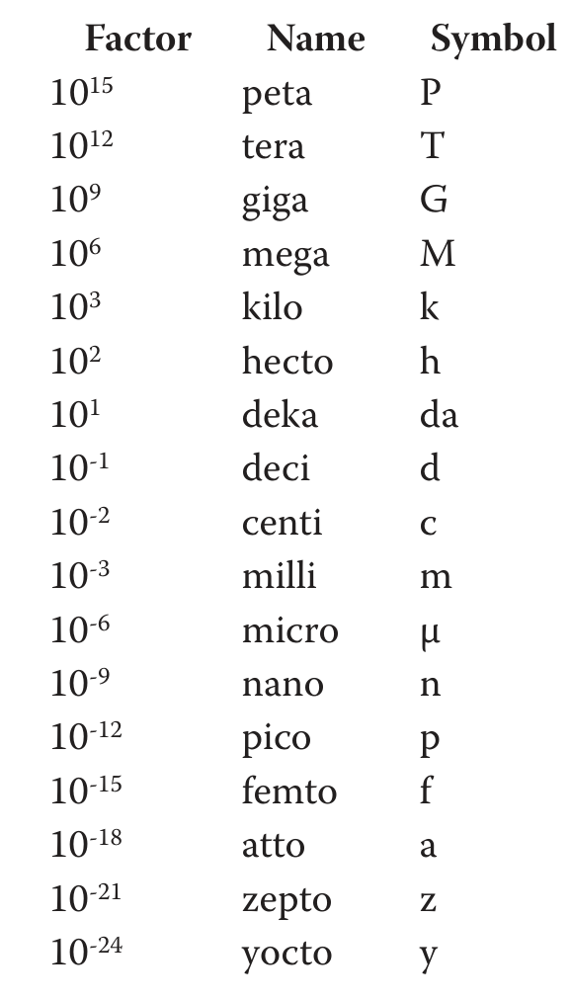
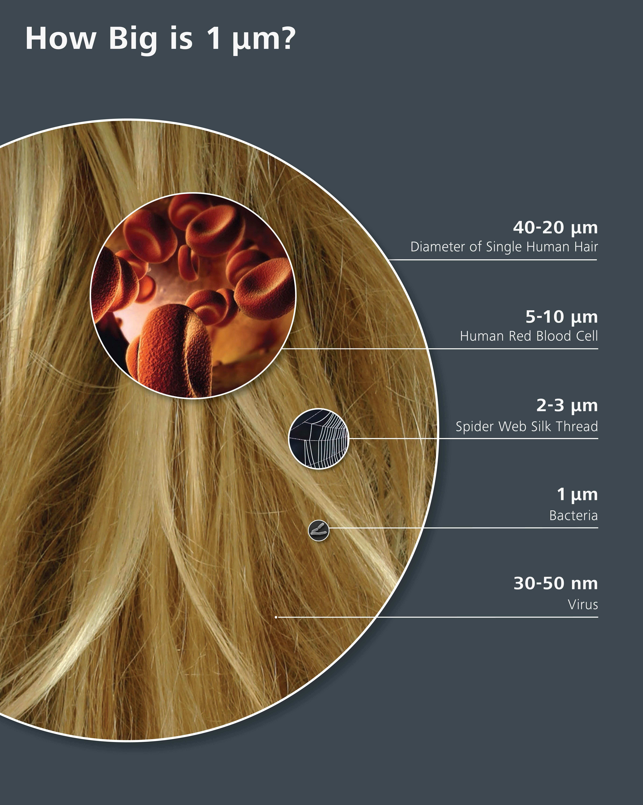
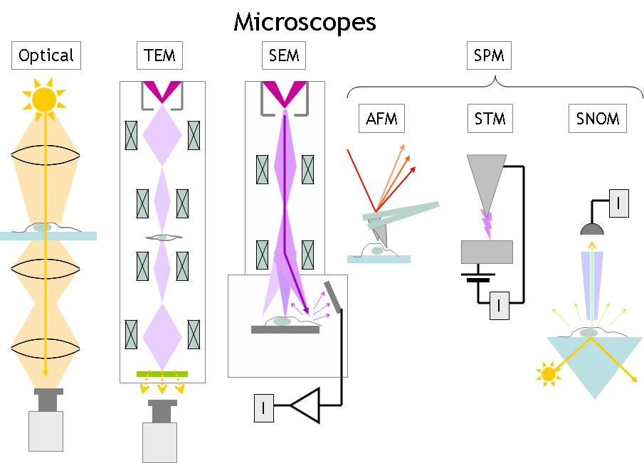
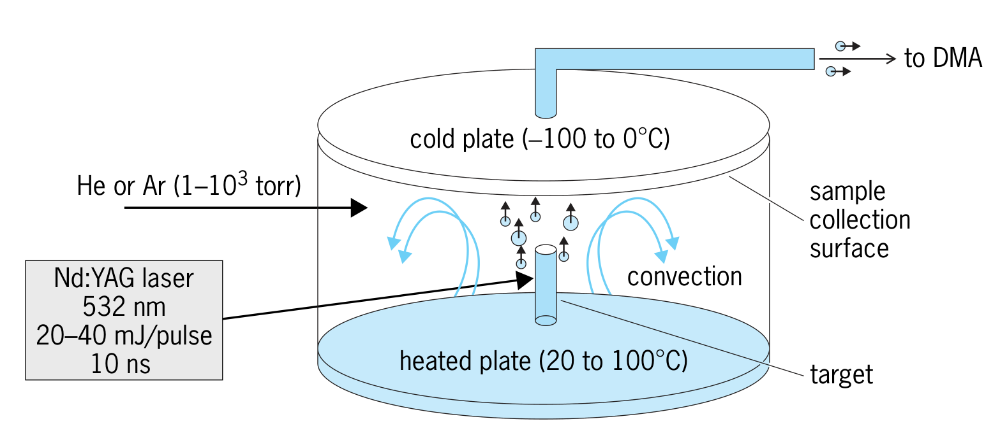
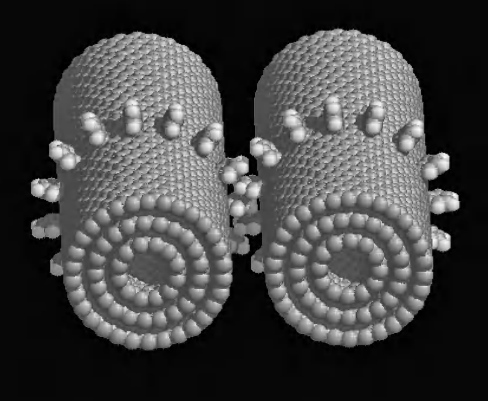
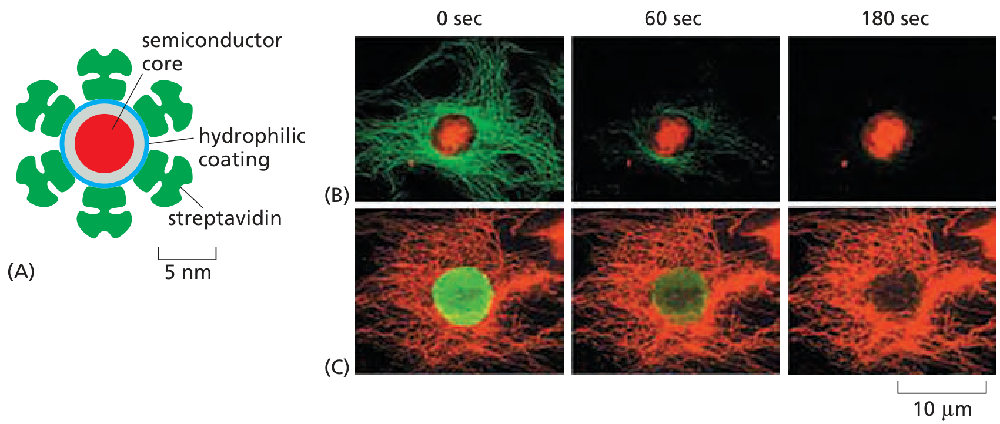
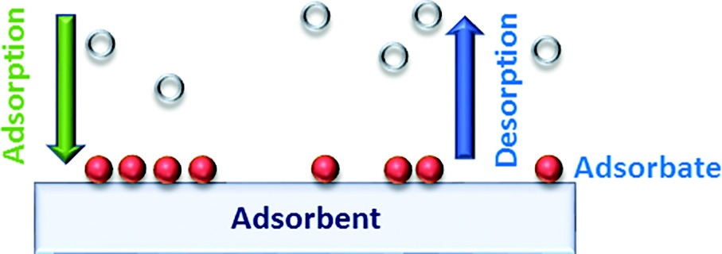
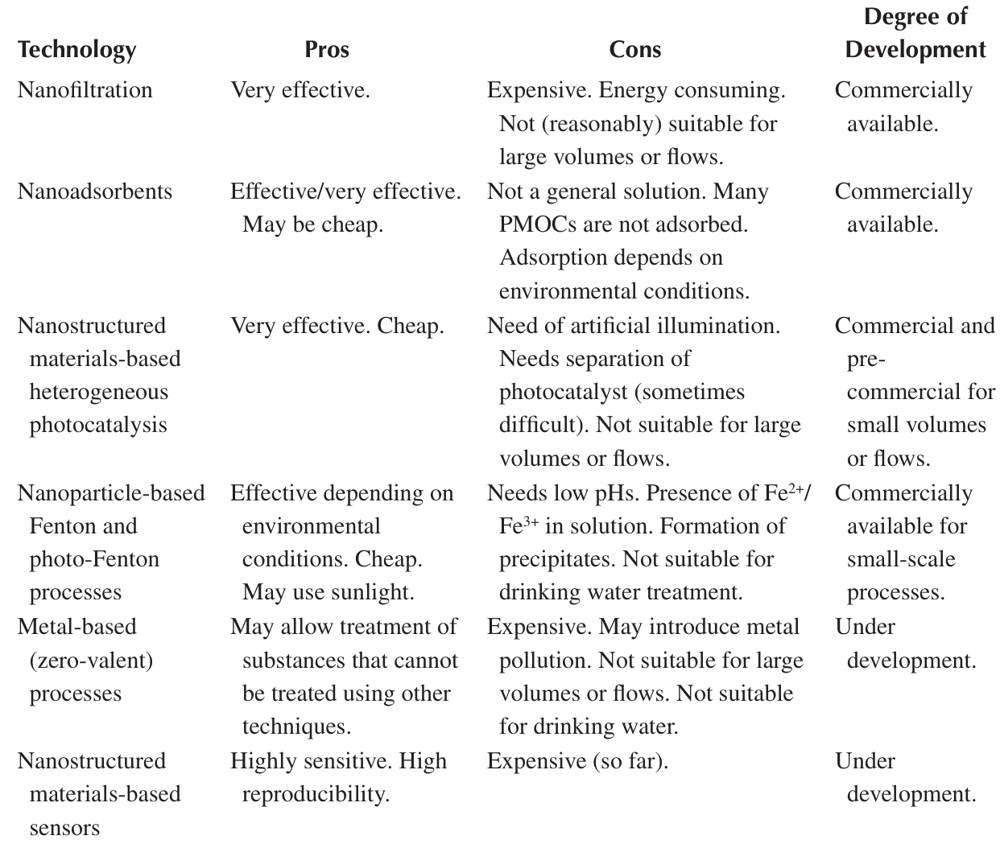

```{r setup, include=FALSE}
library(knitr)
require(tidyverse)
set.seed(453)
# invalidate cache when the package version changes
knitr::opts_chunk$set(tidy = FALSE, echo = FALSE, 
                  message = FALSE, warning = FALSE,
                  out.width = "45%", cache = TRUE, 
                  dev.args=list(bg=grey(0.9), pointsize=11))
options(knitr.table.format = "latex")
options(knitr.kable.NA = "", digits = 2)
options(kableExtra.latex.load_packages = FALSE)
theme_set(theme_bw())
```

# Nanotechnology

##

\bcolumns
\column{0.65\textwidth}
\small
- The term 'nanotechnology' entered widespread use in late 1980s to describe anticipated technologies based on the use of molecule-based machine systems designed to build complex products with atomic precision.
- Nanotechnology involves research and technology development at the 1nm-100nm range ("nanodomain").
- Nanotechnology creates and uses structures that have "\alert{novel properties}" because of their small size and hence high surface area to volume ratio.
- Builds on the ability to control or manipulate at the atomic scale.
- Bacteria can be studied in a the scales of micro-meters. Viruses are in the order of 100nm.
- The study of synthesis and characterization of nanomaterials is known as \alert{nanochemistry}.

\column{0.35\textwidth}

```{r scale-nanotechnology, out.width="70%"}

```

\ecolumns

## Nanoscale effects

\bcolumns
\column{0.3\textwidth}

```{r comparison-of-micro-nano-scale, out.width="98%"}

```

\column{0.4\textwidth}
\footnotesize
- On the one hand, the ratio of surface atoms to bulk atoms in nanoparticles is much more which may lead to situation where surface contributions predominate over bulk contributions to properties.
- On the other hand, as particles become smaller and approach their _de Broglie_ wavelength ($\lambda = \frac{h}{(mv)}$), size effects become more evident because of quantum confinement. If the spacing between quantum levels ($\Delta E$) is higher than thermal excitation energy, i.e., $\Delta E \geq k_B . T$, quantum effects predominate and size effects become very important.

\column{0.3\textwidth}

```{r microscopes-overview, fig.cap="Overview of microscopy", out.width="98%"}

```

\ecolumns

<!-- Light or photon microscopes utilize light of wavelengths from 380 to 760 nanometers for image formation. Such microscopes include the laboratory or bright-field microscope, and modifications of it such as the capillary, centrifuge, chemical, comparison, crystallographic, dark-field, dissecting, fluorescence, integrating, interference, inverted microprojection, museum, nuclear track, petrographic, phase, phosphorescence, and profile microscopes. The beam from a light source is focused onto a sample and either the transmitted or scattered light is collected by an objective lens and the image is magnified onto a camera or to the observers eye. The resolution can be down-to about 200 nm.  -->

<!-- Starting in the 1960s, a variety of spectroscopic methods (such as M ossbauer, nuclear magnetic resonance, infrared, and Raman) were used to understand how atoms are ordered among the crystallographic sites in minerals and to identify the nature of defects and impurities. -->

<!-- In transmission electron microscopy (TEM), developed in 1961, the beam from an electron source illuminates a sample and transmitted and scattered electrons are collected by an objective lens and the image is magnified onto a camera or on a fluorescent screen. It reveals the nanoscale (10–1000 Angstorm) structures of materials/minerals that result from twinning, dislocations, and phase transformations. -->

<!-- Scanning Tunnel Microscope (STM): Electrons from a very bright electron source are focused onto a very sample that has a voltage applied to it. When the tip-sample distance becomes so small that the electron clouds of the tip and sample touch, electrons can much more easily tunnel between the two and this gives rise to a tip-sample current (often a few pA at a 1V bias voltage). This current can be used to maintain a fixed tip-sample distance when the tip is scanned over the sample, and this can give images of conducting surfaces with atomic resolution. -->

<!-- Scanning Near-field Optical Microcsope (SNOM): As electrons can tunnel between electrical conductors, photons can tunnel between optical guiding structures. The SNOM used a narrow light guide to measure how the optical electromagnetic field changes as the guide is moved across the sample. Light can be sent from below the sample and then scattered into the scanning light guide above it. The resolution can be much smaller than the wavelength of light. -->

##

\begin{center}
\begin{tikzpicture}[scale=0.9]

\draw[thick,blue] (0,0) circle (4);

\begin{scope}

\clip (0,0) circle (4);
\foreach \i in {-360,-350,...,360}
{
\draw[blue] (\i:4) circle (2.5);
\draw[black] (\i+12:2) circle (2);
\draw[red] (\i+24:0.5) circle (1);

}

\end{scope}
\end{tikzpicture}
\end{center}

## Silicon nanowires

\small
- Also referred to as SiNWs, these are a type of semiconductor nanowire most often formed from a silicon precursor by etching of a solid or through catalyzed growth from a vapor or liquid phase.
- Applications in lithium ion batteries, thermoelectrics and sensors
  \begin{itemize}
  \footnotesize
  \item Experiment on nanowire solar cells has led to a remarkable improvement of the power conversion efficiency of SiNW solar cells from $\leq 1\%$ to $\geq 17\%$ in the last few years
  \item Exhibit charge trapping behavior which renders such systems of value in applications necessitating electron hole separation such as photovoltaics, and photocatalysts
  \item Possible use as metal insulator semiconductors and field effect transistors, with further applications as nanoelectronic storage devices, in flash memory, logic devices as well as chemical and biological sensors
  \end{itemize}
- Features
  \begin{itemize}
  \footnotesize
  \item High electrical conductivity, owing to the bulk properties of doped Si, with low thermal conductivity due to the small cross section
  \item Unusual quasi one-dimensional electronic structure and are the subject of research
  \item Function as building blocks for nanoscale electronics assembled without the need for complex and costly fabrication facilities
  \end{itemize}

## Synthesis

\footnotesize
1. Top down synthesis
\begin{itemize}
\scriptsize
\item Laser beam ablation
\item Ion beam etching
\item Thermal evaporation oxide-assisted growth (OAG)
\item Metal-assisted chemical etching (MaCE)
\end{itemize}

2. Bottom-up synthesis
\begin{itemize}
\scriptsize
\item Vapour liquid solid (VLS) growth - a type of catalysed CVD often using silane as Si precursor and gold nanoparticles as catalyst (or 'seed').
\item Molecular beam epitaxy - a form of PVD applied in plasma environment
\item Precipitation from a solution - A variation of the VLS method, aptly named supercritical fluid liquid solid (SFLS), that uses a supercritical fluid (e.g. organosilane at high temperature and pressure) as Si precursor instead of vapor. The catalyst would be a colloid in solution, such as colloidal gold nanoparticles, and the SiNWs are grown in this solution.
\end{itemize}

(Refer to the youtube Video -- How to grow silicon nanowires)

## Silver nanoparticles

\bcolumns
\column{0.6\textwidth}
\footnotesize
- Are nano-particles (1nm - 100nm) of Silver ($\mathrm{Ag}$) or silver oxide.
  \begin{itemize}
  \footnotesize
  \item over 300 nanosilver containing products have been identified, most of those marketed as dispersions and powder antimicrobials
  \end{itemize}
- Numerous shapes can be constructed depending on the application -- spherical, diamond, octagonal and thin sheets.
- Large surface area permits the coordination of a vast number of ligands.
- Nanomolecular silver solution reduced the incidence of root diseases.
  - use of a colloidal nanosilver solution may considerably improve the growth and health of various plants

\column{0.4\textwidth}

```{r nanoparticle-synthesis-laser-vapor, fig.cap="Experimental setup for the synthesis of nanoparticles by the laser vaporization controlled-condensation method coupled with a differential mobility analyzer (DMA) for the size selection of the nanoparticles. Common synthesis of metallic and intermetallic nanoparticles includes the decomposition of organometallic precursors, such as metal carbonyls (by thermal, photochemical, laser pyrolysis) to yield the respective element or alloys, and the reduction of inorganic or organometallic precursors by reducing agents. The size of the nanoparticle is determined by the particle residence time, temperature of the chamber, pressure and precursor composition. Vapor-phase synthesis of metallic nano-particles involves evaporation of the material followed by the condensation of clusters, ultimately giving off the nanoparticles from the vapor phase.", out.width="75%"}

```

\ecolumns

## Synthesis

\footnotesize
- Precautions
  \begin{itemize}
  \scriptsize
  \item Wear lab coat, lab shoes, eye protection and follow the lab safety instructions
  \item Avoid light interaction with $\mathrm{Ag NO_3}$ solution 
  \end{itemize}
- Requirements
  \setlength{\multicolsep}{4pt plus 1pt minus 1.5pt}
  \begin{multicols}{3}
  \begin{itemize}
  \setlength{\parskip}{0.1\baselineskip}
  \scriptsize
  \item Beaker
  \item Conical flask
  \item Magnetic stirrer
  \item Magnetic bead
  \item Burette
  \item Silver nitrate
  \item Deionized water
  \item Leaves of desired plants
  \end{itemize}
  \end{multicols}

\footnotesize
- Wash the fresh leaves of desired plant and cut in small pieces
- Setup the magnetic stirrer
- Take 25 g of leaves in 100 ml of DI water
- Set the temperature to \SIrange{80}{90}{\celsius}
- Filter the green extract in Burette to use as reducing and capping agent
- Take 10mg $\mathrm{Ag NO_3}$ in 50ml DI water (Caution: Cover the conical flask with aluminium foil to avoid photo-degradation of Silver.)
- Set the temperature to \SIrange{60}{70}{\celsius}
- Add leaf extract dropwise very slowly until the light yellow color forms.
- The light yellow color in the solution is imparted by silver nano-particles.

##

\bcolumns
\column{0.5\textwidth}
- Carbon nano-tubes
  - Used for building molecular electronics
- Graphene
  - Derived from single sheet of carbon molecules
- Nanoparticles
  - Gold nono-paricles for medical imaging

\column{0.5\textwidth}

```{r carbon-nanotubes, fig.cap="Simulation of a carbon nanotube-based gear.", out.width="70%"}

```

\ecolumns

## Silicon nano-particles (nano-crystallites or quantum dots)

- Unlike bulk silicon (a dull material, inefficient at emitting light), ultrasmall silicon nano-particles are spectacularly efficient at emitting light in RGB colors.
- Sleuth of interests in silicon nanotechnology came nearly a decade after the exciting discover by Canham in 1990 of visible red photoluminescence (PL) at room temperature with a quantum efficiency of few percent, from electrochemically etched silicon (porous silicon (PS) layer).
- The research led by Nayfeh at Illinois in 2000 has shown that reducing the size of an elemental Si crystal to a few tens of atom (~1nm), without altering its chemical composition, effectively creates a new material, a nanoparticle with novel properties - both electronic and non-electronic, including ultrabright ultrastable luminescence.

# Applications of nano-technology

##

\begin{center} % center makes standalone package go berserk! don't use with it.
% scaling of 'every node/.style' will scale the bounding draws as well.
% to scale fonts only create a font style

%\begin{tikzpicture}[every node/.style={scale=0.8}]
\begin{tikzpicture}[scale=0.8, every node/.style={scale=0.4}]

%\draw[step=0.5cm,very thin,black!20] (-6,-6) grid (6,6);

\node[shape=circle, draw=black, text width=2cm, fill=red!20, align=center] (cropsoil) at (0,0) {\small Enhance crop production and soil health};

% anchor is obtained from positioning library
\tikzstyle{technologybox}=[shape=rectangle, draw=blue, anchor=west, fontscale=0.6, text width=2cm, align=center]

\node[technologybox] (A) at (2,2) {Nanofertilizers};
\node[technologybox] (B) at (2,0.5) {Nanopesticides};
\node[technologybox] (C) at (2,-0.5) {Nanobiosensors};
\node[technologybox] (D) at (2, -2) {Nano-enabled remediation of contaminated soils};

\draw[<-] (cropsoil) -- (A);
\draw[<-] (cropsoil) -- (B);
\draw[<-] (cropsoil) -- (C);
\draw[<-] (cropsoil) -- (D);

% \draw[top color=blue!30] (-5,3) rectangle (-3,-3);

\tikzstyle{appliedoutbox}=[shape=rectangle, draw=black, anchor=mid, fontscale=0.7, text width=2.5cm, align=center, rounded]

\node[technologybox] (A1) at (-4,2) {Food technology};
\node[technologybox] (B1) at (-4,0.5) {Biotechnology and genetics};
\node[technologybox] (C1) at (-4,-0.5) {Agronomy and crop physiology};
\node[technologybox] (D1) at (-4,-2) {Soil management and crop nutrition};

\tikzstyle{appliedoutboxbranch}=[shape=rectangle, text width=3cm, fontscale=0.8, align=center, draw=red, scale=0.6]

\node[appliedoutboxbranch, anchor=north] (A11) at (-1,4) {Encapsulement and delivery of materials, flavor development, introducing nano-antimicrobials agents into food, shelf life enhancement, contamination sensing, improved food preservative, monitoring, tracing};
\node[appliedoutboxbranch] (B11) at (-5,1) {Gene delivery, genetic transformation, RNAi};
\node[appliedoutboxbranch] (C11) at (-5,-1) {Enhanced germination, improved seedling vigor better tolerance to stress};
\node[appliedoutboxbranch, anchor=south] (D11) at (-1,-4) {Mineral chelation, improvement of soil physical property, reduced nutrient loss and synergistic effects with soil nutrients};

\draw[<-] (A1) -- (cropsoil);
\draw[<-] (B1) -- (cropsoil);
\draw[<-] (C1) -- (cropsoil);
\draw[<-] (D1) -- (cropsoil);

\draw[<-] (A11) -- (A1);
\draw[<-] (B11) -- (B1);
\draw[<-] (C11) -- (C1);
\draw[<-] (D11) -- (D1);

\end{tikzpicture}
\end{center}

## Benefits to crops

1. Better root growth
2. Better shoot growth
3. Larger leaves and vegetative parts
4. Higher photosynthetic rate
  - $\uparrow$ Fruit and seed yield
  - $\uparrow$ Biomass $\therefore$ better carbon assimilation
5. High concentration of minerals


## In-situ hybridization

\bcolumns
\column{0.55\textwidth}
\footnotesize
- Fluorescence microscopy is often used to detect specific proteins or other molecules in cells and tissues.
- Fluorescent dyes couple with antibody molecules, the distribution of the latter can be visualized when dye, for example, _fluorescein_ is excited with the blue light, which emits an intense green fluorescence.
- Organic fluorochromes fade rapidly when continuously illuminated.
- Nanoparticles can be excited to fluoresce _more stably_ by a broad spectrum of blue light, with their light emission depending on the exact size of the nanocrystal.
  \begin{itemize}
  \scriptsize
  \item  If introduced into a living cell, in an embryo for example, the progeny of that cell can be followed many days later by their fluorescence, allowing cell lineages to be tracked.
  \end{itemize}

\column{0.45\textwidth}
  
```{r nanoparticles-fluorescent-dyes, fig.cap="Fluorescent nanoparticles. (A) Quantum dots are tiny particles of cadmium selenide, a semiconductor, with a coating to make them water-soluble. They can be coupled to protein molecules such as antibodies or streptavidin and, when introduced into a cell, will bind to a target protein of interest. Different-sized quantum dots emit light of different colors -- the larger dot, the longer the wavelength -- but they are all excited by the same blue light. They can continue to fluoresce for weeks, unlike most organic fluorescent dyes. (B) In this cell, microtubules are labelled (green) with an organic fluorescent dye (Alexa 488), while a nuclear protein is stained (red) with quantum dots bound to streptavidin. On continuous exposure to strong blue light, the fluorescent dyes fade quickly while the quantum dots continue to shine. (C) In this cell, the labelling pattern is reversed. Again, the quantum dots far outlast the fluorescent dye.", out.width="98%"}

```

\ecolumns

## Gene delivery

\footnotesize
- Gene delivery systems are essential components of genetic medicine. It involves the transport of genes, which requires a transport vehicle referred to as a \alert{vector}. Possible vectors include viral "shells" or lipid spheres (Liposomes), which have properties that allow them to be incorporated into host cells.
- Current genetic therapies are targeted towards 
- Mesoporous silica nano-particles (MSNs) have been extensively investigated as a drug delivery system, due to its high specific area, high pore volume, tunable pore structure and physicochemical stability.
  \begin{itemize}
  \footnotesize
  \item delivery of both hydrophilic or hydrophobic active agents
  \item delivery of DNA and chemicals into isolated plant cells by coating MSNs
  \item MPS/DNA complexes showed enhanced transfection efficiency through receptor-mediated endocytosis via mannose receptors of the cell wall
  \end{itemize}
- To date, gene editing has become mediated mostly by viral vectors; however, inorganic nanoparticles lately received great importance as carriers for gene delivery or editing systems such as CRISPR. They signify a promising nano-biology tool to transfer some biomolecule such as DNA, RNA, and protein to the targeted plant cells, because of their capability to transport large sizes once used as a vehicle.

## Nano-enabled remediation

\bcolumns
\column{0.55\textwidth}
\footnotesize
- Materials such as metal and metal oxide/sulphide allomorphs, polymers, carbon allotropes, etc. may be transformed, doped or prepared in different morphologies (sizes and shapes), with a variety of surface characteristics.
- Active surface and the number of reactive sites on the surface or the porosity, all related to surface phenomena, have wide range of applications that benefit from nanometric size.
- Persistent and mobile organic compounds (PMOCs) that pose serious health and environment risks are shown to be effectively managed in adsorption and redox processes through the use of nanomaterials.

```{r nono-technology-remediation, out.width="55%", fig.align='center'}

```

\column{0.45\textwidth}

```{r nano-technology-water, fig.cap="Nano-material based technologies used nowadays in water treatment.", out.width="88%"}

```

\ecolumns

## Nanosensors

- Biosensors have been around since glucose monitors were commercialized in the 1970s, but translation into commercial world of major ideas from nanotechnology has lagged.
- Nanomaterials has increasing value for use as electrochemical biosensors due to high sensitivity and fast response times.
  - effective immobilization of biomolecules without altering bioactivity is the key in construction of stable and well-structured electrode material for biosensor platform
- Biosensor systems are ideal tool for real-time monitoring of organophosphate pesticides and nerve agents.
- Bioananalytical nanosensors can be utilized to detect and quantify presence of contaminants (virus, bacteria, toxins) in trace amounts in food and agriculture systems.

## Agronomy and crop physiology

- Silver ($\mathrm{Ag}$) nanoparticles $\longrightarrow$ seed priming of Jasmine $\longrightarrow$ $\uparrow$ Germination %.
- $\mathrm{FeS_2}$ $\longrightarrow$ $\uparrow$ Stress tolerance
- Cesium oxide ($\mathrm{CeO_2}$) $\longrightarrow$ $\downarrow$ Germination % in Radish and Spinach
  - Antioxidants (Catalase, superoxide dismutate, glutathione-peroxidase) reduce the activity of amylase. Like organic counterparts, $\mathrm{CeO_2}$ acts effectively as autocatalytic anti-oxidant thus inhibiting activity of amylase required for promotion of germination.
- Carbon nanotube applied on onion promoted root growth development.
- Starch accumulation of fruit and root biomass of cucumber was positively affected by $\mathrm{ZnO}$.
- $\mathrm{Zn}$ fortified core with $\mathrm{MnCO3}$ nano-shell when applied to soil in rice fields increased the production.

## Nano-fertilizers

\begin{center}
\tikzstyle{block}=[rectangle,draw,fill=blue!20,text width=2cm, text centered, rounded corners, minimum height=3em]
\tikzstyle{rect}=[rectangle, draw=red, fill=orange!50, minimum width=2cm, minimum height=1cm, text centered]
\tikzstyle{line}=[draw, -latex]

% node distance will position the anchored nodes in the 'vertical' and 'horizontal' distances, respectively
\begin{tikzpicture}[node distance=0.5cm and 0.5cm]

\node[rect] (init) {Nano-fertilizers};

\node[block, below left=of init] (seed) {Seed treatment or seed coating};
\node[block, below right=of init] (foliar) {Foliar spray};
\node[block, right=of foliar] (transfection) {Transfection or plant drenching};
\node[block, left=of seed] (soil) {Mixing in soil adjacent to the plant roots};

\node[block, below=of init] (hydroponics) {Hydroponics};

\path[line] (init) -| (seed);
\path[line] (init) -| (foliar);
\path[line] (init) -| (transfection);
\path[line] (init) -| (soil);
\path[line] (init) -- (hydroponics);

\end{tikzpicture}

\end{center}

##

\small
- Metal and metalloids with stable nano-structures when incorporated into soil or made available as fertilizer can enhance nutrient uptake and/or enhance fertilizer use efficiency thus leading to economic and environmental benefits.
- Chemical fertilizers are limited by their poor efficacy subject to loss (by volatilization and leaching). 
- Zinc oxide nanoparticles are among the most widely used manufactured nanoparticles in industrial, commercial, and medicinal products.
- Bulk ZnO generally has phytotoxic effects. Even as compared to ZnSO4 nanoparticles applied in low dose ($\frac{1}{15}$ of the bulk) offer improved effectiveness for soil and foliage application.
  \begin{itemize}
  \footnotesize  
  \item treatment of peanut seeds (with 25 nm particles) have resulted in greater seed germination, seedling vigor, stem and root growth, pod yield and chlorophyll content
  \item in studies with tomato, cabbage and cauliflower, nanoparticles increased seed germination, seedling growth, content of pigments, sugar and activities of nitrate reductase enzyme
  \end{itemize}

# Bibliography

## References

- For an essay about Nanochemistry and Nanotechnology, refer to Page 597, Encyclopedia of Science and Technology, Volume 11.
